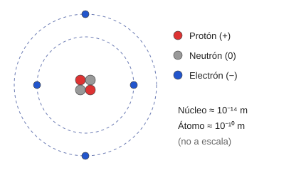
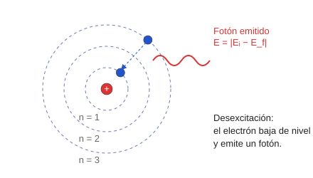
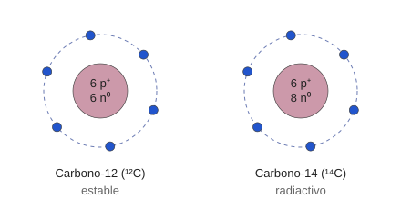

# Módulo 1. La estructura de la materia

*Bases para entender el átomo y la radiación*

> **Al terminar este módulo sabrás:**
> 
> - Describir de qué partículas está formado un átomo, dónde se sitúan y qué carga y masa tienen.
> - Explicar por qué los modelos atómicos fueron cambiando y qué aporta el modelo de Bohr.
> - Interpretar la notación ᴬ₂X y deducir protones, neutrones y electrones de un átomo.
> - Distinguir isótopos e iones, y calcular la carga de un ion.

---

## 1. ¿Qué es la materia?
Una de las primeras preguntas que se hizo la humanidad es qué es la materia y de qué está hecha.

Resulta evidente que el agua, el aire que nos redea, las piedras los humanos o el sol son materia ya que ocupamos un volumen y tenemos masa. No obstante somos muy distintos, tenemos propiedades completamente distintos e interactuamos con otra materia de manera distinta. Es por eso que llegamos a la pregunta, ¿Qué tiene en común toda la materia? ¿Y, qué hace diferenciarnos? Para responder estas preguntas decidieron ir a la raíz del problema, ¿Cuáles son las unidades mínimas que forman la materia?

## 1.1. ¿De qué está hecha la materia?

Un hueso, el aire, el agua o una placa de plomo tienen propiedades muy distintas, pero todos están formados por **átomos**. La palabra viene del griego *a-tomon*, «sin división»: durante siglos se pensó que el átomo era la unidad última e indivisible de la materia.

### Una analogía: la materia como una construcción de LEGO

Antes de entrar en los detalles, imagina que todo lo que te rodea está construido con piezas de LEGO. Hay **pocos tipos de piezas**, pero se pueden combinar de muchísimas maneras. Con la materia ocurre algo parecido: las piezas son los **átomos**.

| En el LEGO | En la materia |
| --- | --- |
| Una pieza | Un **átomo** |
| Un tipo de pieza (forma y color) | Un **elemento químico** (hidrógeno, carbono, oxígeno, calcio…) |
| Piezas encajadas entre sí | Átomos unidos entre sí (**moléculas**) |
| Una construcción terminada | Una **sustancia o material** (agua, aire, hueso, plomo…) |

Con esta idea, muchas cosas se entienden mejor:

- **Pocos tipos de pieza, infinitas construcciones.** Se conocen unos 118 elementos, y con ellos se forma todo lo que existe: desde el agua hasta un hueso.
- **Cada sustancia tiene su «receta».** Una molécula de agua se construye con 2 piezas de hidrógeno y 1 de oxígeno. El plomo de una placa de protección está hecho de un solo tipo de pieza, el plomo.
- **Mismas piezas, resultados distintos.** El diamante y el grafito del lápiz están hechos solo de átomos de carbono, pero colocados de forma diferente, y por eso se comportan de manera muy distinta.

Esta forma de ver la materia, con piezas sólidas que no se rompen, es en esencia la idea de **Dalton** (apartado 1.2).

> **Dónde falla la analogía:** una pieza de LEGO es un bloque macizo, y no se puede dividir en nada más pequeño. El átomo, en cambio, **sí tiene piezas por dentro**. Es lo que vemos a continuación.

### ¿Es realmente indivisible un átomo?

Hoy sabemos que el átomo no es indivisible. A finales del siglo XIX y principios del XX se demostró que el átomo tiene estructura interna: está formado por **partículas subatómicas** repartidas en dos regiones.

| Región | Tamaño aproximado | Qué contiene |
| --- | --- | --- |
| **Núcleo** (centro) | radio ≈ 10⁻¹⁴ m | Protones y neutrones. Concentra casi toda la masa del átomo. |
| **Corteza electrónica** (periferia) | distancia media ≈ 10⁻¹⁰ m | Electrones. |

> **Para hacerte una idea:** el núcleo es unas **10 000 veces más pequeño** que el átomo. Si el núcleo fuese una canica de 1 cm, el átomo entero mediría unos 100 m, como un campo de fútbol. Casi todo el átomo es espacio vacío.

Esquema del átomo

*Figura 1. Estructura del átomo: núcleo con protones y neutrones, y electrones en la corteza.*

### Las tres partículas fundamentales

| Partícula | Localización | Carga (C) | Carga relativa | Masa (kg) | Masa relativa |
| --- | --- | --- | --- | --- | --- |
| **Protón** (p⁺) | Núcleo | +1,6 × 10⁻¹⁹ | +1 | 1,673 × 10⁻²⁷ | ≈ 1 u |
| **Neutrón** (n⁰) | Núcleo | 0 | 0 | 1,675 × 10⁻²⁷ | ≈ 1 u |
| **Electrón** (e⁻) | Corteza | −1,6 × 10⁻¹⁹ | −1 | 9,1 × 10⁻³¹ | ≈ 0 u (despreciable) |

*1 u (unidad de masa atómica) ≈ 1,66 × 10⁻²⁷ kg.*

- **Protón:** tiene carga positiva. **Su número determina de qué elemento químico se trata.**
- **Neutrón:** no tiene carga. Fue descubierto por James Chadwick en 1932. Su masa es ligeramente superior a la del protón y ayuda a estabilizar el núcleo.
- **Electrón:** tiene carga negativa, igual en valor a la del protón pero de signo opuesto. Es unas **1 836 veces más ligero** que el protón.

**Idea clave:** la masa del átomo está casi toda en el núcleo; las propiedades químicas dependen de cuántos protones tiene.

---

## 1.2. Evolución de los modelos atómicos

Un modelo científico es una representación que explica lo que se observa. Cuando aparecen resultados que no encajan, el modelo se sustituye. Esto es lo que ocurrió con el átomo:

| Modelo | Idea principal | Por qué dejó de valer |
| --- | --- | --- |
| **Dalton** (principios del s. XIX) | Esfera maciza, indivisible e indestructible. Todos los átomos de un elemento son idénticos. | Thomson identificó el electrón como partícula aislada: el átomo sí tiene partes. |
| **Thomson** (1904), «pudin de pasas» | Esfera con carga positiva y casi toda la masa, con electrones incrustados como pasas en un bizcocho. | Los experimentos dirigidos por Rutherford mostraron que la carga positiva y la masa están concentradas en un centro diminuto. |
| **Rutherford** (1911), «planetario» | Núcleo central positivo y electrones girando a su alrededor en órbitas, como los planetas alrededor del Sol. | Tiene tres problemas (ver debajo). |
| **Bohr** (1913) | Electrones en órbitas con energías concretas («niveles»). | Es la base del modelo actual (ver 1.3). |

### Los tres problemas del modelo de Rutherford

1. **Estabilidad del núcleo.** Los protones tienen carga positiva y se repelen. Apretados en un espacio tan pequeño, el núcleo debería «estallar».
2. **Estabilidad del electrón.** Según la física clásica, una carga que gira (acelerada) emite energía continuamente. El electrón perdería energía y caería en espiral contra el núcleo en unos 10⁻¹⁰ s. La materia colapsaría.
3. **Espectros de emisión.** Cada elemento emite luz solo en colores (longitudes de onda) muy concretos, siempre los mismos. El modelo no lo explicaba.

El problema 1 se resuelve con la fuerza nuclear fuerte (apartado 1.4). Los problemas 2 y 3 los resuelve Bohr.

---

## 1.3. El modelo de Bohr: la base de la emisión de radiación

En 1913, el danés Niels Bohr aplicó las ideas de Planck y Einstein sobre la cuantización de la luz y propuso tres postulados.

**Postulado 1: órbitas estacionarias.** Los electrones giran en órbitas circulares estables sin emitir energía. La atracción eléctrica del núcleo se compensa con la fuerza centrípeta del giro.

**Postulado 2: cuantización de la energía.** Solo están permitidas ciertas órbitas, con energías concretas. Se identifican con el número entero **n = 1, 2, 3…**, los llamados **niveles de energía** (capas K, L, M…).

- Cuanto más cerca del núcleo (n = 1), más fuertemente está ligado el electrón.
- La **energía de ligadura** de un nivel es la energía mínima necesaria para arrancar el electrón del átomo. A ese proceso se le llama **ionización**.
- En cada nivel caben como máximo **2n²** electrones (2 en el primero, 8 en el segundo, 18 en el tercero…).

**Postulado 3: saltos de energía mediante fotones.** Un electrón solo cambia de nivel si absorbe o emite energía en forma de **fotón**, y este debe llevar exactamente la diferencia de energía entre ambos niveles.

**En resumidas cuentas:** según Bohr los electrones se distribuyen en distintas órbitas (o niveles). Cada nivel está asociado a un número (n = 1, 2, 3, ...). Un electrón tiene una energía distinta según el nivel en el que está. Cada nivel tiene una capacidad máxima de electrones, en el nivel 1 solo caben 2, en el nivel 2 solo caben 8, en el nivel 3 caben 18... 

Si un electrón quiere moverse del nivel 1 al nivel 3 necesita: **primero:** que el nivel no esté lleno, si hay 18 electrones en el nivel 3 no es posible que exista ninguno más. **segundo:** recibir la diferencia de energía necesaria para moverse de uno a otro (el mínimo de energía es la energía del nivel 3 menos la energía del nivel 1).

Para moverse un electrón de un nivel superior a uno inferior pasa lo contrario: **primero:** el nivel inferior debe no estar lleno, **segundo:** debe soltar la energía que le sobra pues al estar en un nivel superior tiene más energía de la que se necesita en el inferior.

| Proceso | Qué ocurre |
| --- | --- |
| **Excitación** | El electrón absorbe un fotón con la energía justa y salta a un nivel superior (n mayor). |
| **Desexcitación** | El electrón cae a un nivel inferior (n menor) y emite un fotón con el exceso de energía. |

> Energía del fotón: **Eγ = | En,i − En,f |** (diferencia de energía entre el nivel inicial *i* y el final *f*).

Transición electrónica según Bohr

*Figura 2. Desexcitación en el modelo de Bohr: el electrón pasa a un nivel inferior y emite un fotón.*

> **En el hospital:** este tercer postulado es el mecanismo detrás de la **radiación X característica** de los tubos de rayos X. Lo verás en detalle en el Módulo 4.

> **Para ir más allá: fórmulas de Bohr**
> 
> - Radio de la órbita n: **rₙ = 0,5 · n² / Z** (en ångström, 1 Å = 10⁻¹⁰ m)
> - Energía del electrón en la órbita n: **Eₙ = −13,6 · Z² / n²** (en electronvoltios, 1 eV = 1,6 × 10⁻¹⁹ J)
> 
> donde Z es el número atómico (ver 1.4). El signo negativo es un convenio: se toma como cero la energía del electrón ya libre, de modo que un electrón ligado tiene menos energía. La energía de ionización es el valor absoluto, |Eₙ|.
> 
> **Ejemplo (hidrógeno, Z = 1).** En n = 1: E₁ = −13,6 eV, así que arrancar su electrón cuesta 13,6 eV. En n = 2: E₂ = −3,4 eV. Si el electrón cae de n = 2 a n = 1, emite un fotón de |−3,4 − (−13,6)| = **10,2 eV**.
> 
> Para el wolframio (Z = 74), la fórmula da unos 74 keV para el nivel K; el valor real es ≈ 70 keV. Es el orden de energía de los rayos X de diagnóstico.
> 
> El modelo de Bohr funciona exactamente solo para átomos con un electrón, pero describe bien la idea de fondo para los demás.

---

## 1.4. Identidad nuclear: Z, N y A

### Los números que definen un núcleo
Hasta ahora para definir un átomo hemos hablado de **número de protones**, **número de neutrones** y **número de electrones**. Aunque esta notación es completamente adecuada en física se utiliza otra (Z, A). 

Debemos recordar que lo que más define a un átomo es **el numero de protones**, por así decirlo es el *DNI del elemento*. Conociendo el **Número atómico (Z)** (número de protones) podemos definir la mayoría de propiedades del átomo. En física el numero de protones se dice con la letra Z. Si decimos que un átomo tiene Z = 12, sabemos que tiene 12 protones y que estamos hablando del elemento llamado *Magnesio (Mg)*. Sabiendo el numero Z del átomo, podemos identificar a que elemento pertenece tan solo buscando en la tabla periódica.

*Ejercicio: Busca los elementos con Z = 1, 6, 92. Truco busca en la tabla periodica el número que viene en la esquina superior izquierda.*

Por otro lado el otro número que usamos para definir un átomo es el **número másico (A)**

| Símbolo | Nombre | Qué es |
| --- | --- | --- |
| **Z** | Número atómico | Número de **protones**. Define el elemento y su posición en la tabla periódica. |
| **N** | Número de neutrones | Número de **neutrones**. |
| **A** | Número másico | Número de **nucleones** (protones + neutrones): **A = Z + N**, es decir, **N = A − Z**. |

En un átomo **neutro**, el número de electrones es igual a Z.

**Notación:** ᴬ₂X, donde X es el símbolo del elemento. Como X y Z dan la misma información, a menudo se escribe solo ᴬX (por ejemplo, ¹⁴C).

### Ejemplo resuelto 1: carga y masa de un átomo de carbono

Un átomo neutro de carbono tiene 6 protones, 6 neutrones y 6 electrones.

**Carga:**

- Protones: 6 × (+1,6 × 10⁻¹⁹ C) = +9,6 × 10⁻¹⁹ C
- Electrones: 6 × (−1,6 × 10⁻¹⁹ C) = −9,6 × 10⁻¹⁹ C
- Neutrones: 0 C
- **Carga neta = 0 C** (átomo neutro).

**Masa:**

- Protones: 6 × 1,673 × 10⁻²⁷ = 10,038 × 10⁻²⁷ kg
- Neutrones: 6 × 1,675 × 10⁻²⁷ = 10,050 × 10⁻²⁷ kg
- Electrones: 6 × 9,1 × 10⁻³¹ = 0,00546 × 10⁻²⁷ kg
- **Masa total ≈ 20,093 × 10⁻²⁷ kg**

Los electrones aportan menos del 0,03 % de la masa total: **la masa está casi toda en el núcleo**.

### Ejemplo resuelto 2: del símbolo a las partículas

Átomo de aluminio, ²⁷₁₃Al:

- Z = 13 → **13 protones**.
- N = A − Z = 27 − 13 = **14 neutrones**.
- Neutro → **13 electrones**.
- Masa aproximada: A ≈ **27 u**.

---

### La fuerza nuclear fuerte

Si los protones se repelen, ¿por qué el núcleo no se rompe? La gravedad es demasiado débil para evitarlo. Se postuló una nueva interacción de la naturaleza, la **interacción nuclear fuerte**, que tiene estas características:

- Es **atractiva** y muy intensa.
- Es de **muy corto alcance**: solo actúa a distancias del orden del tamaño del núcleo (\~10⁻¹⁴ m).
- **No depende de la carga**: atrae igual a protones y neutrones.

Los neutrones aportan atracción sin añadir repulsión eléctrica, por eso actúan como «estabilizadores» del núcleo.

## 1.5. Isótopos: mismo elemento, distinta masa

Los **isótopos** son átomos del mismo elemento (mismo Z, mismo número de protones) con **distinto número másico A**, es decir, con distinto número de neutrones.

Como tienen los mismos protones y electrones, **todos los isótopos de un elemento se comportan igual químicamente**. Cambian su masa y su **estabilidad nuclear**: unos son estables y otros son radiactivos.

|  | Carbono-12 (¹²C) | Carbono-14 (¹⁴C) |
| --- | --- | --- |
| Protones (Z) | 6 | 6 |
| Neutrones (N = A − Z) | 6 | 8 |
| Electrones (neutro) | 6 | 6 |
| Carga neta | 0 C | 0 C |
| Masa aproximada | ≈ 12 u | ≈ 14 u |
| Estabilidad | Estable | **Inestable (radiactivo)** |

Isótopos del carbono

*Figura 3. Isótopos del carbono: mismo Z (6 protones) y distinto número de neutrones.*

**Conclusión:** el ¹⁴C tiene dos neutrones de más. Eso aumenta su masa y lo hace inestable. Los núcleos inestables son los que emiten radiación (Módulo 3).

---

## 1.6. Iones: cuando se rompe el equilibrio eléctrico

En un átomo neutro, **protones = electrones**. Si el átomo pierde o gana electrones, esa igualdad se rompe y se forma un **ion**. Los protones no cambian: el elemento sigue siendo el mismo.

| Tipo | Qué ocurre | Carga |
| --- | --- | --- |
| **Catión** | Pierde uno o más electrones | Positiva |
| **Anión** | Gana uno o más electrones | Negativa |

La **radiación ionizante** es justamente la que tiene energía suficiente para arrancar electrones de la corteza y producir iones. Esto es lo que da nombre a este tipo de radiación (Módulo 2).

### Ejemplo resuelto 3: formación de un catión

Átomo de calcio (Z = 20): 20 protones y 20 electrones. Una radiación ionizante le arranca **2 electrones**.

- Protones: 20 × (+1,6 × 10⁻¹⁹) = +3,2 × 10⁻¹⁸ C
- Electrones: 18 × (−1,6 × 10⁻¹⁹) = −2,88 × 10⁻¹⁸ C
- **Carga neta = +3,2 × 10⁻¹⁹ C = +2 cargas elementales** → Ca²⁺

### Ejemplo resuelto 4: formación de un anión

Átomo de cloro (Z = 17): 17 protones y 17 electrones. Capta **1 electrón**.

- Carga neta = 17 − 18 = **−1 carga elemental = −1,6 × 10⁻¹⁹ C** → Cl⁻

---

## Resumen del módulo

- El átomo tiene **núcleo** (protones + neutrones, casi toda la masa) y **corteza** (electrones).
- **Z** (protones) define el elemento; **A = Z + N**; en un átomo neutro, electrones = Z.
- Los modelos de Dalton, Thomson y Rutherford fueron superados; **Bohr** introduce los **niveles de energía** y los saltos con emisión o absorción de **fotones**.
- La **fuerza nuclear fuerte** mantiene unido el núcleo.
- Los **isótopos** tienen el mismo Z y distinto A; algunos son radiactivos.
- Un **ion** es un átomo con carga: catión (pierde electrones) o anión (gana electrones). La radiación ionizante los produce.

## Glosario

| Término | Significado |
| --- | --- |
| **Nucleón** | Partícula del núcleo (protón o neutrón). |
| **Nivel de energía** | Órbita permitida para un electrón, identificada por n. |
| **Energía de ligadura** | Energía mínima necesaria para arrancar un electrón de su nivel. |
| **Fotón** | Paquete de energía de la radiación electromagnética. |
| **Ionización** | Proceso por el que un átomo pierde un electrón. |
| **u** | Unidad de masa atómica (≈ 1,66 × 10⁻²⁷ kg). |
| **eV** | Electronvoltio, unidad de energía (1 eV = 1,6 × 10⁻¹⁹ J). |

---

## Ejercicios propuestos

1. Un núcleo de fósforo se representa como ³¹₁₅P. ¿Cuántos protones, neutrones y electrones tiene en estado neutro?
2. Un átomo neutro tiene 26 electrones y A = 56. ¿Cuántos neutrones tiene y cuál es su número atómico Z?
3. Un átomo tiene Z = 8 y N = 10. Escribe su símbolo en la notación ᴬ₂X (el elemento con Z = 8 es el oxígeno, O) y calcula su carga neta en estado neutro.
4. Un átomo de magnesio (Z = 12) pierde 2 electrones. ¿Cuál es su carga neta en cargas elementales? ¿Cómo se escribe el ion?
5. Un átomo de azufre (Z = 16) gana 2 electrones. ¿Cuántos electrones tiene ahora y cuál es su carga neta? ¿Es un catión o un anión?

## Soluciones

1. Z = 15 → **15 protones**; N = 31 − 15 = **16 neutrones**; neutro → **15 electrones**.
2. Neutro → Z = 26 (hierro, Fe). N = 56 − 26 = **30 neutrones**.
3. A = 8 + 10 = 18 → **¹⁸₈O** (oxígeno-18). Neutro: 8 protones y 8 electrones → carga neta **0 C**.
4. 12 protones y 10 electrones → **+2 cargas elementales** (+3,2 × 10⁻¹⁹ C). Ion: **Mg²⁺**.
5. 16 + 2 = **18 electrones**; carga neta 16 − 18 = **−2** (−3,2 × 10⁻¹⁹ C). Es un **anión**: **S²⁻**.

---

**Siguiente módulo:** ahora que sabes qué es un ion, el Módulo 2 explica qué es la radiación y por qué algunas radiaciones son capaces de producirlos y otras no.