# Módulo 2. Métodos de transmisión de energía

*¿Cómo viaja la energía de un punto a otro y qué es realmente la radiación?*

> **Al terminar este módulo sabrás:**
> 
> - Explicar con la «prueba del espacio exterior» qué métodos de transmisión de energía necesitan materia y cuáles no.
> - Definir qué es la radiación.
> - Distinguir entre ondas electromagnéticas y radiación de partículas.
> - Dar ejemplos de cada método, también en medicina.

---

## 2.1. El gran experimento mental: la prueba del espacio exterior

Para entender la física de la radiación sin perderse en fórmulas, basta con hacerse una pregunta muy simple: **¿cómo puede viajar la energía desde un emisor hasta un receptor?**

La mejor forma de comprobarlo es someter cada tipo de energía a la **«prueba del espacio exterior»**, es decir, al **vacío**. En el espacio casi no hay átomos ni moléculas flotando: es esencialmente la nada. Si colocamos algo en el espacio, nos preguntamos:

- ¿Puede transmitir energía?
- ¿Necesita apoyarse en átomos intermedios para avanzar, como quien cruza un río pisando piedras, o es capaz de cruzar el vacío por sí mismo?

La respuesta divide todos los fenómenos en **dos grandes familias**: los que **necesitan materia** y los que **no la necesitan** (la radiación).

**Idea clave:** si la energía puede cruzar el vacío, hablamos de radiación.

---

## 2.2. Métodos que REQUIEREN un medio material

*No funcionan en el espacio.*

### Transmisión de calor por contacto o fluidos (conducción y convección)

En nuestro día a día en la Tierra estamos permanentemente sumergidos en materia (aire o agua):

- **En el mar:** al meterte en agua fría, las moléculas de agua en contacto directo con tu piel absorben tu energía térmica y te enfrían rápidamente.
- **En el aire:** una ráfaga de viento caliente calienta tu cuerpo porque el aire en movimiento (convección) transporta la energía hacia ti.
- **En el espacio:** al no haber moléculas de aire ni de ningún gas a tu alrededor, nada te transmite ni te roba calor por contacto directo o por corrientes.

> La conducción y la convección son físicamente imposibles en el vacío absoluto porque les faltan las «manos» (las partículas) para pasarse la energía unas a otras.

### Ondas mecánicas (vibraciones y sonido)

El sonido es una **perturbación mecánica**: una molécula empuja a la vecina, esa a la siguiente, y así sucesivamente, en una reacción en cadena de compresiones y dilataciones.

- Para que haya sonido tiene que haber **materia vibrando** (aire, agua, metal, tejido humano).
- **En el espacio:** no hay atmósfera. Si una nave explota a diez metros de ti en el espacio exterior, no oirás absolutamente nada. La frase de la película *Alien* es una verdad física literal: *«En el espacio nadie puede oír tus gritos»*. Sin un soporte de partículas que choquen entre sí, las ondas sonoras no pueden propagarse.

---

## 2.3. Métodos que NO requieren un medio material: la RADIACIÓN

Llamamos **radiación** a todo proceso en el que la energía viaja a través del espacio **sin necesidad de apoyarse en un medio material**, es decir, capaz de propagarse en el vacío absoluto.

Solo existen **dos formas** de lograrlo.

### A. Ondas electromagnéticas: la energía pura que viaja sola

No son partículas materiales chocando entre sí. Son **oscilaciones acopladas de un campo eléctrico y un campo magnético** que se impulsan mutuamente a través del espacio.

> **La prueba del espacio:** por la noche miras al cielo y ves estrellas que están a millones de años luz. Entre esa estrella y tus ojos hay billones de kilómetros de vacío casi absoluto. La luz (y los rayos X, o la radiación infrarroja térmica del Sol) no necesita carreteras de aire ni de agua para viajar: cruza el cosmos vacío y llega hasta la Tierra.

### B. Radiación de partículas: los proyectiles que cruzan el vacío

La otra forma de enviar energía sin un medio que la conduzca es, sencillamente, **lanzar un proyectil físico con masa y velocidad**.

> **La analogía del meteorito en el espacio.** Imagina que flotas en mitad del vacío interestelar. Entre un meteorito que viene hacia ti y tu traje espacial no hay nada: cero aire, cero materia. ¿Impide eso que llegue hasta ti? En absoluto. El meteorito no necesita aire para viajar: lo hace por inercia y transporta una enorme cantidad de **energía cinética** (energía de movimiento). Cuando choca contra ti, descarga de golpe toda esa energía, destruyendo el traje y transfiriéndote su fuerza de impacto.

La radiación de partículas funciona exactamente igual, pero a escala microscópica:

- En lugar de un meteorito gigante, son **«balas subatómicas»** lanzadas a altísima velocidad: núcleos de helio (**partículas alfa, α**), electrones veloces (**partículas beta, β**) o **neutrones** libres.
- No necesitan aire para viajar: cruzan el vacío y, cuando colisionan contra los átomos de tus células o de una placa radiográfica, **descargan su energía cinética** en ellos, arrancándoles electrones o rompiendo enlaces químicos.

---

## 2.4. Tabla resumen de métodos de transmisión

| Método | ¿Qué viaja? | ¿Requiere medio material? | ¿Funciona en el espacio exterior? | Ejemplo en la vida real y en medicina |
| --- | --- | --- | --- | --- |
| **Conducción / convección** | Calor por choque térmico directo de moléculas | **SÍ** (sólido, líquido o gas) | NO | Enfriarse al sumergirse en agua de mar; quemarse al tocar una plancha |
| **Ondas mecánicas** | Vibración y presión de la materia | **SÍ** (imprescindible) | NO | El sonido de la voz; el ultrasonido de una ecografía |
| **Ondas electromagnéticas** | Campos eléctricos y magnéticos oscilantes | **NO** (viaja en el vacío) | **SÍ** (es radiación) | La luz de las estrellas; las microondas; los rayos X de un hospital |
| **Radiación de partículas** | Proyectiles subatómicos con masa y velocidad | **NO** (viaja en el vacío) | **SÍ** (es radiación) | Partículas α y β; neutrones |

---

## Resumen del módulo

- La **prueba del espacio exterior** (el vacío) separa los métodos de transmisión de energía en dos familias.
- **Necesitan medio material:** conducción y convección (calor) y ondas mecánicas (sonido, ultrasonidos).
- **No lo necesitan** y se llaman **radiación:** ondas electromagnéticas (luz, rayos X) y radiación de partículas (α, β, neutrones).
- Las ondas electromagnéticas son campos eléctrico y magnético que se propagan juntos; la radiación de partículas es energía cinética transportada por proyectiles subatómicos.

---

**Siguiente módulo:** ahora que sabes qué es la radiación, toca clasificarla según el efecto que produce en la materia: radiación ionizante y no ionizante.