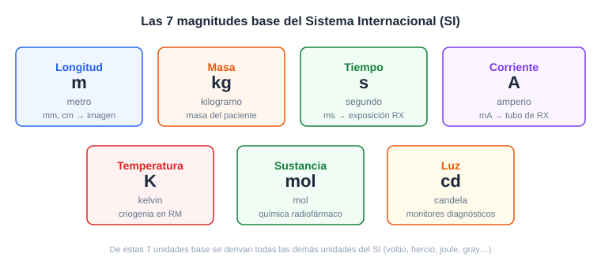
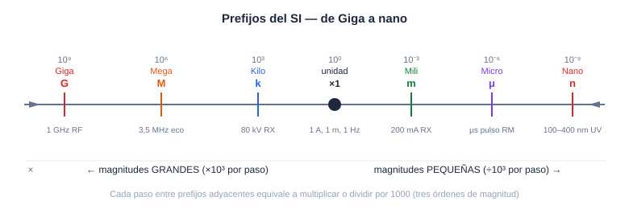
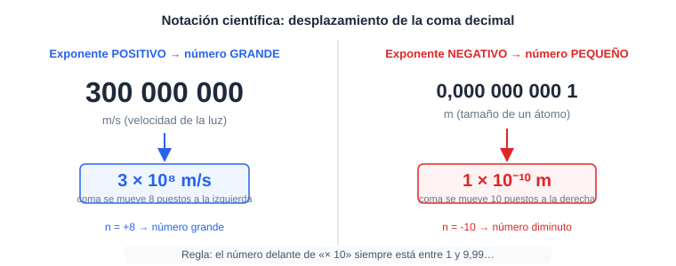
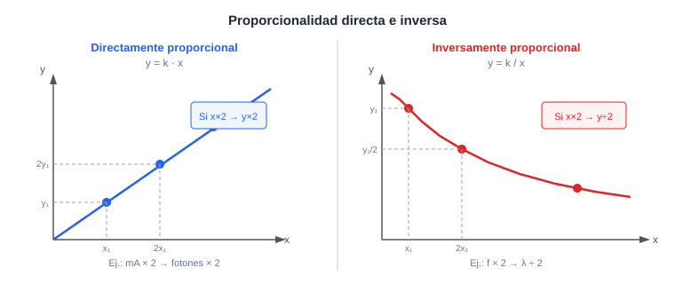

# Módulo 0. Caja de herramientas básicas

*Lo que necesitas saber antes de empezar: números, unidades y cómo manejar fórmulas sin sufrir*

> **Al terminar este módulo sabrás:**
> - Identificar qué es una magnitud física y por qué siempre va acompañada de su unidad.
> - Interpretar los prefijos del Sistema Internacional (kilo, mega, mili, micro…) y convertir entre ellos.
> - Leer y escribir números en notación científica para manejar cantidades muy grandes o muy pequeñas.
> - Despejar la incógnita de una fórmula sencilla aplicando la regla del balancín.

---

## 0.1. Magnitudes y unidades: el idioma de medir las cosas

Todo aquello que se puede medir es una **magnitud física**: la distancia de un tumor a la piel, el tiempo que dura una exploración, la energía de un rayo X. Pero un número solo no dice nada.

Piensa en esto: el médico indica «el nódulo mide 8». ¿8 qué? ¿8 milímetros? ¿8 centímetros? Sin la unidad, el dato es inútil —y en clínica, la diferencia puede ser crítica.

> **Idea clave:** Una magnitud física = número + unidad. Sin la unidad, el número no tiene sentido físico.

### El Sistema Internacional de Unidades (SI)

Para que médicos, ingenieros y científicos de todo el mundo hablen el mismo idioma, existe un acuerdo global: el **Sistema Internacional de Unidades (SI)**. Define siete unidades base de las que se derivan todas las demás:

| Magnitud | Unidad SI | Símbolo |
|---|---|---|
| Longitud | metro | m |
| Masa | kilogramo | kg |
| Tiempo | segundo | s |
| Corriente eléctrica | amperio | A |
| Temperatura | kelvin | K |
| Cantidad de sustancia | mol | mol |
| Intensidad luminosa | candela | cd |

En imagen médica usarás sobre todo metros (o sus múltiplos), segundos, amperios y kiloelectronvoltios para la energía. Las unidades de dosis y actividad radiactiva las estudiaremos en el Módulo 8.

> **En la práctica profesional:** Cuando ajustas los parámetros de un equipo de rayos X (kV, mA, ms), cada número lleva su unidad: kilovoltios controlan la energía de los fotones; miliamperios controlan la cantidad. Confundir la unidad es confundir el parámetro.

*Figura 1. Las siete magnitudes base del SI y los equipos hospitalarios en los que aparecen.*

---

## 0.2. Los prefijos multiplicadores: de lo gigante a lo diminuto

En un hospital mides cosas enormes —la frecuencia de un ecógrafo, que puede ser de 3 000 000 Hz— y cosas microscópicas —la longitud de onda de los rayos X, en el orden de 0,000 000 001 metros—. Escribir todos esos ceros es tedioso y fuente de errores. Los **prefijos del SI** son atajos oficiales que te permiten comprimir esos ceros en una sola letra.

### Prefijos para magnitudes grandes («multiplicadores»)

| Prefijo | Símbolo | Factor | Ejemplo clínico |
|---|---|---|---|
| kilo | k | $\times 10^3$ (mil) | 80 kV en radiografía de tórax |
| mega | M | $\times 10^6$ (millón) | 3,5 MHz en sonda ecográfica |
| giga | G | $\times 10^9$ (mil millones) | 1 GHz en algunos equipos de RF |

### Prefijos para magnitudes pequeñas («divisores»)

| Prefijo | Símbolo | Factor | Ejemplo clínico |
|---|---|---|---|
| mili | m | $\times 10^{-3}$ (milésima) | 200 mA en sala de rayos X |
| micro | μ | $\times 10^{-6}$ (millonésima) | microsegundos de pulso en RM |
| nano | n | $\times 10^{-9}$ (milmillonésima) | longitud de onda UV (~100–400 nm) |
| pico | p | $\times 10^{-12}$ | tamaño de átomos (~100 pm) |

> **Idea clave:** Un prefijo es simplemente una potencia de 10 pegada a la unidad. Kilo = $10^3$, mili = $10^{-3}$, mega = $10^6$, micro = $10^{-6}$.

### Cómo convertir entre prefijos

La conversión es siempre una multiplicación o división por la potencia de 10 correspondiente:

$$1\ \text{MHz} = 10^6\ \text{Hz} \qquad \qquad 1\ \text{mA} = 10^{-3}\ \text{A} = \frac{1}{1000}\ \text{A}$$

**Ejemplo resuelto:** Un ecógrafo trabaja a 7,5 MHz. ¿Cuántos hercios son?

- Dato: $f = 7{,}5\ \text{MHz}$
- Factor: $1\ \text{MHz} = 10^6\ \text{Hz}$
- Sustitución: $f = 7{,}5 \times 10^6\ \text{Hz}$
- Resultado: **$7\ 500\ 000\ \text{Hz}$** — razón por la que usamos el prefijo mega.

*Figura 2. Línea de prefijos del SI, de giga ($10^9$) a nano ($10^{-9}$), con ejemplos clínicos en cada escala.*

> **Dónde falla la analogía:** Comparar prefijos con «pisos de un edificio» funciona para subir (mega > kilo > unidad), pero recuerda que bajar de piso implica dividir, no restar. Pasar de MHz a kHz no es restar, es multiplicar por 1000.

---

## 0.3. Notación científica: el truco del «10»

Incluso con prefijos, a veces los números son difíciles de manejar. La velocidad de la luz es $300\ 000\ 000\ \text{m/s}$. Cargar de ceros ese número aumenta la probabilidad de equivocarse al escribirlo o leerlo. La **notación científica** resuelve esto expresando cualquier número como:

$$\text{número} = a \times 10^n \quad \text{donde} \quad 1 \leq a < 10 \text{ y } n \in \mathbb{Z}$$

En palabras: escribes solo los dígitos significativos (entre 1 y 9,999…) y el exponente de 10 indica cuántos puestos se mueve la coma.

### El exponente positivo: números grandes

Cada vez que el exponente sube en 1, la coma se desplaza un puesto a la derecha (el número se hace 10 veces mayor).

$$3 \times 10^8\ \text{m/s} \quad \Leftrightarrow \quad 300\ 000\ 000\ \text{m/s}$$

### El exponente negativo: números pequeños

Cuando el exponente es negativo, la coma se desplaza a la izquierda (el número se hace más pequeño).

$$1 \times 10^{-10}\ \text{m} \quad \Leftrightarrow \quad 0{,}000\ 000\ 000\ 1\ \text{m} \quad \text{(tamaño de un átomo)}$$

> **Idea clave:** Exponente positivo → número grande. Exponente negativo → número diminuto. El número delante de «$\times 10$» siempre está entre 1 y 10.

**Ejemplo resuelto — convertir 0,0045 A a notación científica:**

1. Buscamos el primer dígito significativo: el «4».
2. Contamos cuántos puestos hemos movido la coma hasta dejarlo como $4{,}5$: tres puestos a la derecha → exponente $-3$.
3. Resultado: **$4{,}5 \times 10^{-3}\ \text{A}$**, es decir, **$4{,}5\ \text{mA}$**.

*Figura 3. Desplazamiento de la coma decimal al convertir a notación científica: exponente positivo (derecha) y negativo (izquierda).*

> **En la práctica profesional:** Los fabricantes de equipos médicos expresan la longitud de onda de los rayos X en ångströms ($1\ \text{Å} = 10^{-10}\ \text{m}$) o en nanómetros. Saber leer notación científica te permite comparar esas cifras de forma inmediata.

---

## 0.4. Proporcionalidad: la regla del «si tú subes, yo también»

Muchas de las leyes que veremos en este curso relacionan dos magnitudes entre sí. Solo existen dos tipos de relación posibles, y dominarlas te ahorrará tener que memorizar comportamientos:

### Relación directamente proporcional

Dos magnitudes son **directamente proporcionales** cuando al multiplicar una por un factor, la otra se multiplica por el mismo factor. Si una crece, la otra crece en la misma medida.

$$y = k \cdot x \quad (k = \text{constante positiva})$$

**Analogía:** La velocidad de un coche y la distancia recorrida en un tiempo fijo. Si vas el doble de rápido, recorres el doble de kilómetros.

**Ejemplo físico:** En un tubo de rayos X, la intensidad de corriente del tubo (mA) es directamente proporcional al número de fotones emitidos. Si doblas los mA, obtienes el doble de fotones (y por tanto el doble de dosis al paciente).

### Relación inversamente proporcional

Dos magnitudes son **inversamente proporcionales** cuando al multiplicar una por un factor, la otra se divide por ese mismo factor. Si una sube, la otra baja.

$$y = \frac{k}{x} \quad (k = \text{constante positiva})$$

**Analogía:** La velocidad en coche y el tiempo para llegar a un destino fijo. Si vas el doble de rápido, tardas la mitad.

**Ejemplo físico en ondas:** La frecuencia ($f$) y la longitud de onda ($\lambda$) de una onda están inversamente relacionadas: $v = \lambda \cdot f$. Si la frecuencia se duplica, la longitud de onda se reduce a la mitad (a velocidad constante).

> **Idea clave:** Directamente proporcional → misma dirección (ambas suben o ambas bajan). Inversamente proporcional → direcciones opuestas (una sube, la otra baja).

*Figura 4. Izquierda: gráfica de proporcionalidad directa (recta que pasa por el origen). Derecha: gráfica de proporcionalidad inversa (hipérbola).*

> **Dónde falla la analogía:** La proporcionalidad supone que la relación es constante en todo el rango. En la realidad, muchos fenómenos físicos son solo aproximadamente proporcionales en un tramo concreto de valores. Fuera de ese tramo, la relación puede ser no lineal.

---

## 0.5. Despejar fórmulas: el arte de dejar la incógnita sola

A lo largo del curso habrá momentos en los que necesitarás calcular una magnitud a partir de otras. La buena noticia: con tres reglas basta para el 95 % de los casos.

### La regla del balancín

Una ecuación es como un balancín perfectamente equilibrado: ambos lados pesan lo mismo. Si haces algo a un lado, debes hacer **exactamente lo mismo** al otro para mantener el equilibrio.

| Operación en el lado de la incógnita | Qué haces al otro lado |
|---|---|
| Está sumando ($+ a$) | Restas $a$ |
| Está restando ($- a$) | Sumas $a$ |
| Está multiplicando ($\times a$) | Divides entre $a$ |
| Está dividiendo ($\div a$) | Multiplicas por $a$ |

### Ejemplo paso a paso con $v = \lambda \cdot f$

Esta es la **ecuación de onda**, que relaciona la velocidad de propagación ($v$), la longitud de onda ($\lambda$) y la frecuencia ($f$).

**Problema:** Un ultrasonido viaja a $v = 1540\ \text{m/s}$ en tejido blando. Si su frecuencia es $f = 5\ \text{MHz}$, ¿cuál es su longitud de onda $\lambda$?

1. **Fórmula original:** $v = \lambda \cdot f$
2. **Despejar $\lambda$:** la $f$ está multiplicando en el lado derecho; pasa al otro lado dividiendo:
$$\lambda = \frac{v}{f}$$
3. **Sustituir valores:** $f = 5\ \text{MHz} = 5 \times 10^6\ \text{Hz}$
$$\lambda = \frac{1540\ \text{m/s}}{5 \times 10^6\ \text{Hz}}$$
4. **Calcular:**
$$\lambda = 3{,}08 \times 10^{-4}\ \text{m} = \mathbf{0{,}308\ \text{mm}}$$

> **En la práctica profesional:** Una longitud de onda de 0,3 mm determina la resolución mínima que puede alcanzar ese transductor ecográfico —no puede «ver» detalles menores que su propia longitud de onda. Los transductores de alta frecuencia (10–15 MHz) tienen longitudes de onda más cortas y mayor resolución, pero menor penetración.

> **Idea clave:** Para despejar, aplica la operación inversa al término que quieres aislar, y hazlo a ambos lados de la ecuación al mismo tiempo.

---

## Resumen del módulo

- **Magnitud = número + unidad.** Sin la unidad el dato es incompleto e inútil en clínica.
- **Los prefijos del SI** (kilo, mega, mili, micro, nano…) son potencias de 10 comprimidas en un símbolo; permiten expresar cantidades muy grandes o muy pequeñas sin chorros de ceros.
- **La notación científica** escribe cualquier número como $a \times 10^n$ ($1 \leq a < 10$). El exponente indica cuántos puestos se desplaza la coma decimal.
- **Proporcionalidad directa:** misma dirección de cambio ($y = k \cdot x$). **Inversa:** direcciones opuestas ($y = k / x$).
- **Despejar una incógnita** equivale a aplicar la operación inversa a ambos lados de la ecuación (regla del balancín).

## Glosario

| Término | Definición precisa y sencilla |
|---|---|
| **Magnitud física** | Propiedad del mundo real que se puede medir y expresar con un número y una unidad. |
| **Unidad** | Patrón de referencia con el que se compara la magnitud al medirla (p. ej., metro, segundo). |
| **Sistema Internacional (SI)** | Acuerdo global que define las siete unidades base y sus derivadas para garantizar coherencia científica. |
| **Prefijo SI** | Símbolo que precede a una unidad e indica la potencia de 10 por la que se multiplica (k = $10^3$, m = $10^{-3}$…). |
| **Notación científica** | Forma de escribir números como $a \times 10^n$, donde $1 \leq a < 10$ y $n$ es un número entero positivo o negativo. |
| **Proporcionalidad directa** | Relación entre dos magnitudes tal que su cociente es constante: si una se duplica, la otra también. |
| **Proporcionalidad inversa** | Relación entre dos magnitudes tal que su producto es constante: si una se duplica, la otra se reduce a la mitad. |
| **Despejar** | Operación algebraica que aísla una incógnita a un lado de la ecuación aplicando la operación inversa a ambos lados. |
| **Exponente** | El número $n$ en $10^n$ que indica cuántos puestos se desplaza la coma decimal. |

---

## Ejercicios propuestos

1. **Reconocimiento de unidades.** Un informe de TC indica que el nódulo mide «8» sin especificar la unidad. Razona por qué este dato es inutilizable clínicamente y qué unidad del SI sería la correcta para una medida anatómica de ese rango.

2. **Conversión de prefijos.** Un equipo de RM opera a una frecuencia de Larmor de 63,87 MHz para un campo de 1,5 T. Expresa esa frecuencia en hercios (Hz) y en kilohercios (kHz) usando notación científica.

3. **Notación científica — de número a potencia.** La carga del electrón es $0{,}000\ 000\ 000\ 000\ 000\ 000\ 16\ \text{C}$. Exprésala en notación científica.

4. **Notación científica — de potencia a número.** La longitud de onda de un rayo X diagnóstico típico es $\lambda = 6 \times 10^{-11}\ \text{m}$. ¿Cuántos nanómetros es eso? (Recuerda: $1\ \text{nm} = 10^{-9}\ \text{m}$.)

5. **Proporcionalidad.** En una sala de rayos X, si mantienes el kV constante y doblas la intensidad de corriente de 100 mA a 200 mA, ¿qué ocurre con el número de fotones emitidos y con la dosis al paciente? Razona si se trata de una relación directa o inversa.

6. **Despejar fórmula.** La ley de la onda es $v = \lambda \cdot f$. Un transductor ecográfico emite ondas de longitud de onda $\lambda = 0{,}5\ \text{mm}$ en un tejido donde la velocidad del sonido es $v = 1540\ \text{m/s}$. Despeja $f$ y calcula la frecuencia de trabajo del transductor en MHz.

## Soluciones

1. Sin la unidad no es posible saber si el nódulo mide 8 mm (benigno probable), 8 cm (muy relevante) u 8 alguna otra unidad. La unidad SI de longitud es el **metro (m)**; para medidas anatómicas en ese rango se usa el submúltiplo **milímetro (mm)** o **centímetro (cm)**, derivados del SI.

2. Conversión: $63{,}87\ \text{MHz} = 63{,}87 \times 10^6\ \text{Hz} = \mathbf{6{,}387 \times 10^7\ \text{Hz}}$. En kilohercios: $6{,}387 \times 10^7\ \text{Hz} \div 10^3 = \mathbf{6{,}387 \times 10^4\ \text{kHz}}$.

3. Contamos los puestos que mueve la coma hasta el primer dígito significativo («1»): 19 puestos a la derecha → exponente $-19$. Resultado: **$1{,}6 \times 10^{-19}\ \text{C}$**.

4. $6 \times 10^{-11}\ \text{m} \div 10^{-9}\ \text{m/nm} = 6 \times 10^{-11+9}\ \text{nm} = 6 \times 10^{-2}\ \text{nm} = \mathbf{0{,}06\ \text{nm}}$. Los rayos X son mucho más cortos que la luz visible (400–700 nm), lo que refleja su altísima energía y capacidad penetrante.

5. El número de fotones (y la dosis) es **directamente proporcional** a la intensidad de corriente (mA). Al doblar los mA de 100 a 200, se emiten el doble de fotones y la dosis al paciente se **duplica**. Se trata de una relación directa: $\text{Dosis} \propto \text{mA}$.

6. Despeje: de $v = \lambda \cdot f$ se obtiene $f = v / \lambda$. Convertimos: $\lambda = 0{,}5\ \text{mm} = 0{,}5 \times 10^{-3}\ \text{m} = 5 \times 10^{-4}\ \text{m}$.
$$f = \frac{1540\ \text{m/s}}{5 \times 10^{-4}\ \text{m}} = \frac{1540}{5} \times 10^4\ \text{Hz} = 308 \times 10^4\ \text{Hz} = \mathbf{3{,}08\ \text{MHz}}$$
Un transductor de 3 MHz es típico de aplicaciones abdominales donde se necesita mayor penetración.

---

**Siguiente módulo:** Ahora que manejas el idioma de la física —números, unidades y fórmulas— ya estás listo para explorar de qué está hecha la materia que los rayos X y los ultrasonidos van a atravesar: el átomo y sus componentes. Eso es exactamente lo que veremos en el Módulo 1.
