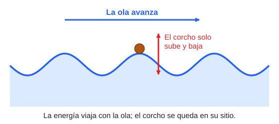
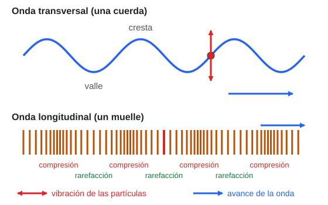
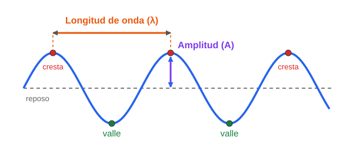
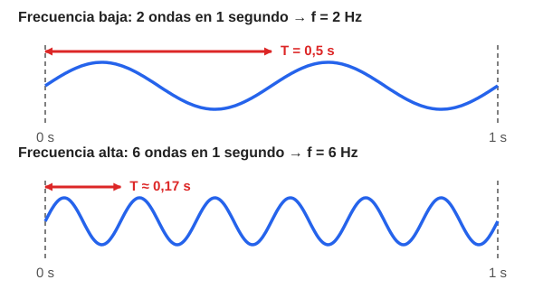
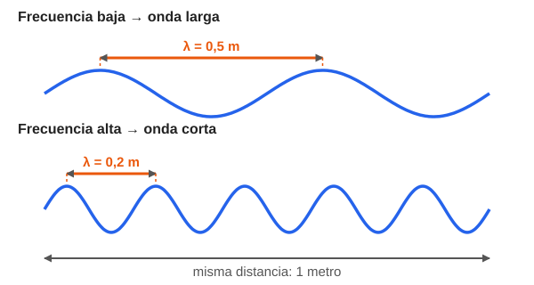
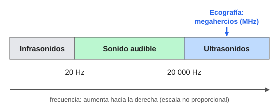
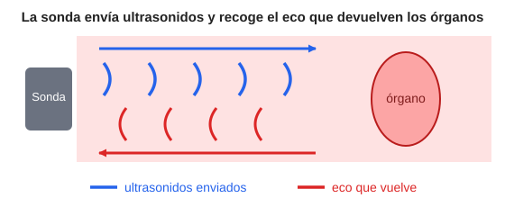

# Módulo 4. El mundo de las ondas

*De la ecografía a las medidas básicas de una onda*

> **Al terminar este módulo sabrás:**
> 
> - Explicar qué es una onda con tus propias palabras.
> - Distinguir ondas transversales y longitudinales.
> - Explicar qué son la amplitud, la longitud de onda, la frecuencia, el periodo y la velocidad de una onda, y cómo se relacionan.
> - Describir cómo funciona una ecografía y por qué no usa radiación ionizante.

---

## 4.1. ¿Qué es una onda?

Para entender cómo funcionan la luz, los rayos X o los ultrasonidos en un hospital, primero hay que tener muy claro **qué es una onda** y **cómo se mide**.

Una onda **no es un objeto**. Es una **perturbación que viaja** de un sitio a otro y que transporta **energía**, pero **no transporta materia**.

Un ejemplo: la **ola** que hace el público en un estadio. La ola da la vuelta entera al campo, pero ningún espectador cambia de sitio: cada uno solo se levanta y se sienta. Viaja el movimiento, no las personas.

Lo mismo pasa con una ola en el mar. Si echas un corcho al agua, verás que **el corcho no avanza con la ola**: solo sube y baja.

*Figura 1. Una onda en el agua. La ola avanza, pero el corcho solo sube y baja alrededor de su sitio.*

Ese sitio donde se queda cada partícula cuando no hay onda se llama **posición de equilibrio** (o de reposo).

> **Idea clave:** en una onda **viaja la energía**; la materia solo **vibra** alrededor de su posición de equilibrio.

---

## 4.2. Tipos de ondas mecánicas: transversales y longitudinales

Como vimos en el Módulo 2, las **ondas mecánicas** necesitan un medio material (agua, aire, tejido humano…) para viajar. Según **cómo vibran las partículas** respecto a la dirección en la que avanza la onda, hay dos tipos:

|  | **Onda transversal** | **Onda longitudinal** |
| --- | --- | --- |
| **Cómo vibran las partículas** | **Perpendicular** a la dirección de avance (arriba y abajo) | En la **misma dirección** que el avance (adelante y atrás) |
| **Ejemplo** | Agitar una cuerda | El sonido; empujar y soltar un muelle |
| **Partes de la onda** | **Crestas** (puntos más altos) y **valles** (puntos más bajos) | **Compresiones** (partículas apretadas) y **rarefacciones** (partículas separadas) |

*Figura 2. Arriba, onda transversal: la cuerda sube y baja mientras la onda avanza hacia la derecha. Abajo, onda longitudinal: las espiras del muelle se acercan y se alejan en la misma dirección en la que avanza la onda.*

- En una **compresión**, las partículas están más juntas que en reposo, así que la presión y la densidad **aumentan**.
- En una **rarefacción** (también llamada **dilatación**), las partículas están más separadas que en reposo, así que la presión y la densidad **disminuyen**.

> Las ondas electromagnéticas (la luz, los rayos X…) también son transversales. Lo veremos en el Módulo 5.

---

## 4.3. Las medidas de una onda

Sea una ola del mar, un sonido o un rayo X, **todas las ondas se describen con las mismas cinco medidas**. Vamos a verlas una a una, con un dibujo y un ejemplo cotidiano.

*Figura 3. Las partes de una onda. La línea de puntos es la posición de equilibrio.*

### 1. Amplitud (A): lo alta que es la onda

**Qué es:** la distancia desde la posición de equilibrio hasta lo más alto de una cresta.

**Cómo imaginarlo:** una ola pequeña y una ola enorme. La enorme tiene más amplitud.

**Para qué sirve saberlo:** cuanta más amplitud, **más energía** transporta la onda. En el sonido, mayor amplitud significa que se oye **más fuerte**.

### 2. Longitud de onda (λ): lo larga que es la onda

La letra griega **λ** se lee «lambda».

**Qué es:** la distancia entre **dos crestas seguidas**. También vale entre dos compresiones seguidas, o entre cualquier punto de la onda y el siguiente punto idéntico.

**Cómo imaginarlo:** la distancia que hay entre una ola y la siguiente cuando miras el mar desde la playa.

**Unidad:** el **metro (m)**. Como las ondas que veremos pueden ser muy cortas, se usan unidades más pequeñas:

| Unidad | Símbolo | Equivale a |
| --- | --- | --- |
| Milímetro | mm | 0,001 m |
| Nanómetro | nm | 0,000 000 001 m |
| Ångström | Å | 0,000 000 000 1 m |

> Los rayos X tienen longitudes de onda diminutas, del orden de un ångström.

### 3. Frecuencia (f): cuántas ondas pasan cada segundo

Se representa con **f** o con la letra griega **ν** («nu»).

**Qué es:** el número de ondas completas que pasan por un punto **en un segundo**.

**Cómo imaginarlo:** estás en la playa con el agua por las rodillas y cuentas cuántas olas te golpean en un segundo. Eso es la frecuencia.

**Unidad:** el **hercio (Hz)**. **1 Hz = 1 onda por segundo.** Para números grandes se usan múltiplos:

| Unidad | Símbolo | Equivale a |
| --- | --- | --- |
| Kilohercio | kHz | 1 000 Hz |
| Megahercio | MHz | 1 000 000 Hz |

*Figura 4. Frecuencia y periodo. Arriba pasan 2 ondas en un segundo (f = 2 Hz) y cada onda tarda 0,5 s. Abajo pasan 6 ondas en un segundo (f = 6 Hz) y cada onda tarda unos 0,17 s.*

### 4. Periodo (T): lo que tarda una onda

**Qué es:** el **tiempo que tarda en pasar una onda completa**. Se mide en segundos (s).

**Relación con la frecuencia:** son **inversos**. Si pasan muchas ondas por segundo, cada una tarda poco.

> **T = 1 / f** y **f = 1 / T**

| Frecuencia (f) | Periodo (T) |
| --- | --- |
| 2 Hz (2 ondas por segundo) | 0,5 s |
| 4 Hz | 0,25 s |
| 10 Hz | 0,1 s |

### 5. Velocidad de propagación (v): lo rápido que avanza la onda

**Qué es:** la distancia que recorre la onda en un segundo. Se mide en **metros por segundo (m/s)**.

**Cómo calcularla:**

> **v = λ · f** (velocidad = longitud de onda × frecuencia)

**Cómo entender esta fórmula con una analogía:** imagina que caminas.

- Cada paso mide **0,5 m** (es como la longitud de onda).
- Das **4 pasos por segundo** (es como la frecuencia).
- Avanzas 0,5 × 4 = **2 m cada segundo** (es la velocidad).

Con las ondas pasa igual: cada onda mide λ y pasan f ondas por segundo, así que la onda avanza λ · f metros cada segundo.

Si necesitas despejar:

> **λ = v / f** y **f = v / λ**

**La velocidad depende del medio.** Algunos valores aproximados para el sonido:

| Medio | Velocidad del sonido |
| --- | --- |
| Aire | ≈ 340 m/s |
| Agua | ≈ 1 500 m/s |
| Tejido blando del cuerpo | ≈ 1 540 m/s |

> Las ondas electromagnéticas viajan a la velocidad de la luz, c = 3 × 10⁸ m/s (300 000 km/s). Lo veremos en el Módulo 5.

#### Ejemplo resuelto

**Una nota musical (la) tiene una frecuencia de 440 Hz. ¿Qué longitud de onda tiene en el aire?**

- Datos: f = 440 Hz; v = 340 m/s.
- λ = v / f = 340 / 440 ≈ **0,77 m**.

### La regla de oro: longitud de onda y frecuencia van en sentido contrario

Si la onda avanza siempre a la misma velocidad, **cuantas más ondas pasan por segundo, más cortas tienen que ser**.

Vuelve a la analogía de caminar: si quieres avanzar lo mismo cada segundo pero das **muchos pasos**, cada paso tiene que ser **corto**. Si das pocos pasos, cada uno es **largo**.

*Figura 5. En la misma distancia de 1 metro caben 2 ondas largas o 5 ondas cortas. Más ondas (frecuencia alta) significa ondas más cortas (longitud de onda corta).*

> **Idea clave:** frecuencia alta → longitud de onda corta. Frecuencia baja → longitud de onda larga.

### Resumen de las cinco medidas

| Medida | Símbolo | Qué es, en una frase | Unidad |
| --- | --- | --- | --- |
| **Amplitud** | A | Lo alta que es la onda (más amplitud, más energía) | Depende de lo que vibre |
| **Longitud de onda** | λ | Distancia entre dos crestas seguidas | metro (m) |
| **Frecuencia** | f o ν | Número de ondas que pasan por segundo | hercio (Hz) |
| **Periodo** | T | Tiempo que tarda una onda en pasar (T = 1/f) | segundo (s) |
| **Velocidad** | v | Lo rápido que avanza la onda (v = λ · f) | metro por segundo (m/s) |

---

## 4.4. El sonido y los ultrasonidos en medicina

### El sonido

El sonido es un ejemplo perfecto de **onda mecánica y longitudinal**. Cuando hablamos, nuestras cuerdas vocales empujan el aire y crean compresiones y rarefacciones que viajan hasta hacer vibrar el tímpano de quien nos escucha. Por eso el sonido es una **onda de presión**.

Como es una onda mecánica, **necesita un medio** (aire, agua, tejido…). En el vacío no se propaga.

### Qué sonidos podemos oír

El ser humano solo oye sonidos con frecuencias **entre 20 y 20 000 Hz**. Por debajo hay **infrasonidos** y por encima, **ultrasonidos**. Los ultrasonidos son sonidos de frecuencia muy alta, por tanto de longitud de onda muy corta. Nosotros no los oímos, pero los usan, por ejemplo, murciélagos y delfines para orientarse.

*Figura 6. Tipos de sonido según su frecuencia. Los ultrasonidos de la ecografía médica operan en el orden de los megahercios (MHz).*

### La ecografía y el concepto de interfase tisular

La **ecografía** (o ultrasonografía) utiliza ultrasonidos para visualizar el interior del cuerpo mediante la emisión y recepción de ecos:

1. La **sonda (transductor)** emite pulsos de ultrasonidos hacia el interior del cuerpo.
2. La onda viaja por los tejidos hasta llegar a la **frontera o interfase** entre dos estructuras o tejidos distintos.
3. En esa interfase, una parte de la onda **se refleja (rebota como un eco)** hacia la sonda, mientras que el resto continúa propagándose hacia planos más profundos.
4. La sonda **recoge el eco** y el ecógrafo calcula la profundidad y la forma de la estructura a partir del tiempo que tarda el sonido en regresar, construyendo la imagen en tiempo real.

*Figura 7. Funcionamiento de una ecografía: emisión de ultrasonidos y captación de los ecos reflejados en las interfases anatómicas.*

> **La base física: ¿por qué se produce el eco? (Interfase e impedancia acústica)**
> 
> Una onda de ultrasonido no rebota dentro de un medio perfectamente homogéneo; el rebote ocurre al cruzar la **interfase** (límite de separación) entre dos medios con diferente **impedancia acústica (Z)**.
> 
> - La **impedancia acústica** es la resistencia que opone un material al paso de las ondas sonoras, y depende directamente de su **densidad** ($\rho$) y de la **velocidad del sonido** en ese medio ($v$): **Z = ρ · v**.
> - **Pequeña diferencia de impedancia:** Entre dos tejidos blandos similares (por ejemplo, entre el hígado y el riñón), la diferencia es leve: la mayor parte de la onda continúa avanzando hacia planos más profundos y solo un pequeño eco rebota, permitiendo visualizar los órganos internos sin bloquear el haz.
> - **Gran diferencia de impedancia:** Entre el tejido blando y el hueso, o entre la sonda y el aire, la diferencia de impedancia es gigantesca: prácticamente toda la onda rebota de golpe en la superficie, impidiendo ver lo que hay detrás (sombra acústica).
> 
> **¿Por qué se usa gel ecográfico?** En la práctica clínica se aplica siempre gel conductor entre la sonda y la piel para **eliminar cualquier burbuja de aire**. La enorme disparidad de impedancia entre el cristal de la sonda y el aire provocaría que el ultrasonido rebotara casi al 100 % antes de penetrar en el paciente.

> **En el hospital:** la ecografía es una técnica **no invasiva** y **no usa radiación ionizante**: los ultrasonidos son ondas mecánicas de presión y no tienen energía cuántica para arrancar electrones de las moléculas. Por eso es una técnica de primera elección totalmente inocua, habitual en obstetricia, ginecología y cardiología.

#### Ejemplo resuelto: ¿qué longitud de onda tiene una ecografía?

**Una ecografía usa ultrasonidos de 5 MHz. ¿Qué longitud de onda tienen en el tejido blando?**

- Datos: f = 5 MHz = 5 000 000 Hz; v = 1 540 m/s.
- λ = v / f = 1 540 / 5 000 000 = 0,000 308 m ≈ **0,31 mm**.

Son **décimas de milímetro**. Esa longitud de onda tan corta es lo que permite que la ecografía distinga detalles muy pequeños.

---

## Resumen del módulo

- Una **onda** es una perturbación que viaja y transporta **energía, no materia**.
- Las ondas mecánicas pueden ser **transversales** (vibración perpendicular al avance: crestas y valles) o **longitudinales** (vibración en la misma dirección: compresiones y rarefacciones).
- Las cinco medidas de una onda son **amplitud, longitud de onda, frecuencia, periodo y velocidad**.
- **T = 1/f** y **v = λ · f**. Con velocidad constante, **a más frecuencia, menos longitud de onda**.
- El **sonido** es una onda mecánica longitudinal. Los **ultrasonidos** (más de 20 000 Hz) se usan en la **ecografía**, que no emplea radiación ionizante.

## Glosario

| Término | Significado |
| --- | --- |
| **Onda** | Perturbación que viaja transportando energía sin transportar materia. |
| **Posición de equilibrio** | Lugar donde está una partícula cuando no hay onda. |
| **Cresta / valle** | Punto más alto / más bajo de una onda transversal. |
| **Compresión / rarefacción** | Zona donde las partículas están más juntas / más separadas (onda longitudinal). |
| **Amplitud (A)** | Distancia de la posición de equilibrio a la cresta. |
| **Longitud de onda (λ)** | Distancia entre dos crestas (o dos compresiones) seguidas. |
| **Frecuencia (f)** | Número de ondas que pasan por un punto en un segundo. |
| **Hercio (Hz)** | Unidad de frecuencia: 1 onda por segundo. |
| **Periodo (T)** | Tiempo que tarda en pasar una onda completa. |
| **Velocidad de propagación (v)** | Distancia que avanza la onda en un segundo. |
| **Ultrasonido** | Sonido de frecuencia superior a 20 000 Hz. |
| **Eco** | Parte de una onda que rebota y vuelve al emisor al cruzar una frontera. |
| **Interfase tisular** | Límite o superficie de contacto entre dos tejidos con diferentes propiedades acústicas. |
| **Impedancia acústica (Z)** | Resistencia que opone un medio a la propagación del sonido ($Z = \rho \cdot v$). Su diferencia entre medios determina la intensidad del eco reflejado. |

---

## Ejercicios propuestos

1. Por un punto pasan 10 ondas cada segundo. ¿Cuál es su frecuencia y cuál es su periodo?
2. Una onda tiene un periodo de 0,02 s. ¿Cuál es su frecuencia?
3. Un sonido de 1 000 Hz viaja por el aire a 340 m/s. ¿Qué longitud de onda tiene?
4. Una ecografía usa ultrasonidos de 2 MHz. Si la velocidad en el tejido es 1 540 m/s, ¿qué longitud de onda tienen? Exprésala en milímetros.
5. Se comparan ultrasonidos de 2 MHz y de 10 MHz en el mismo tejido. ¿Cuáles tienen la longitud de onda más corta?
6. Verdadero o falso: «Una onda transporta materia de un sitio a otro». Justifica tu respuesta.

## Soluciones

1. f = **10 Hz**; T = 1 / 10 = **0,1 s**.
2. f = 1 / T = 1 / 0,02 = **50 Hz**.
3. λ = v / f = 340 / 1 000 = **0,34 m**.
4. f = 2 000 000 Hz; λ = 1 540 / 2 000 000 = 0,000 77 m = **0,77 mm**.
5. Los de **10 MHz**: λ = 1 540 / 10 000 000 = 0,000 154 m = 0,154 mm, frente a 0,77 mm los de 2 MHz. A más frecuencia, menos longitud de onda.
6. **Falso.** La onda transporta energía, pero las partículas solo vibran alrededor de su posición de equilibrio, como el corcho en el agua.

---

**Siguiente módulo:** ahora que sabes cómo se describe una onda, el Módulo 5 trata de las **ondas electromagnéticas**. Imagina todo lo que hemos visto, pero quitando el aire y el agua: lo que vibra ahora son campos eléctricos y magnéticos que viajan a la velocidad de la luz.