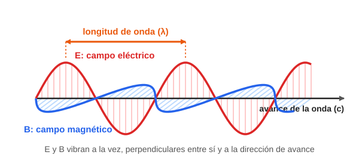
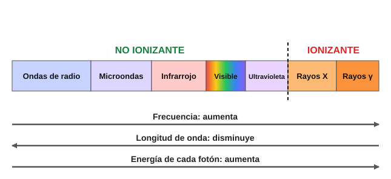
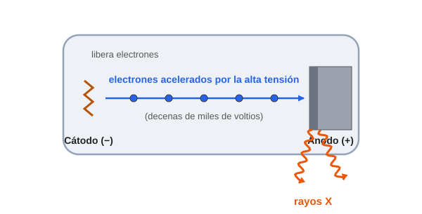
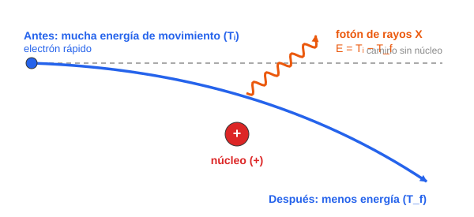
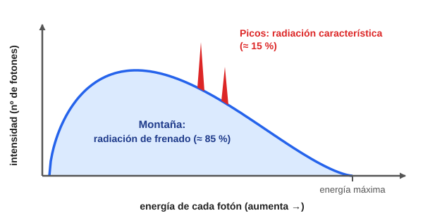

# Módulo 5. Ondas electromagnéticas y rayos X

*Qué es la radiación electromagnética, cómo se ordena y cómo se producen los rayos X*

> **Al terminar este módulo sabrás:**
> 
> - Explicar qué es una onda electromagnética y en qué se diferencia del sonido.
> - Usar la fórmula c = λ · ν para pasar de frecuencia a longitud de onda y al revés.
> - Situar cada tipo de radiación en el espectro electromagnético e indicar cuáles son ionizantes.
> - Describir cómo se producen los rayos X en un tubo: radiación de frenado y radiación característica.
> - Interpretar el espectro de un haz de rayos X.

---

## 5.1. Ondas en el vacío: la radiación electromagnética

En el Módulo 2 vimos que el sonido necesita un medio (aire, agua, tejido) y que en el espacio no se oiría nada. La **radiación electromagnética** es distinta: es energía que viaja en forma de onda **sin necesidad de ningún medio material**. Por eso la luz del Sol llega hasta nosotros atravesando el vacío.

### ¿Qué vibra en una onda electromagnética?

En el sonido vibran las moléculas del aire. Aquí no hay moléculas que empujar. Lo que vibra son dos **campos**.

> **¿Qué es un campo?** Es una zona del espacio donde se nota una influencia a distancia, sin tocar nada. Un **imán** atrae un clip sin tocarlo: eso es un **campo magnético (B)**. Un globo frotado en el pelo atrae papelitos sin tocarlos: eso es un **campo eléctrico (E)**.

Una onda electromagnética es la combinación de un campo eléctrico (E) y un campo magnético (B) que:

- son **inseparables**: vibran a la vez y se «empujan» el uno al otro mientras avanzan;
- vibran **perpendicularmente entre sí**;
- y a su vez son **perpendiculares a la dirección de avance** de la onda.

Como vibran perpendicularmente al avance, son **ondas transversales** (como la cuerda del Módulo 4).

Onda electromagnética: campo eléctrico y campo magnético perpendiculares

*Figura 1. Onda electromagnética. El campo eléctrico (rojo) y el campo magnético (azul) vibran a la vez, en direcciones perpendiculares entre sí, mientras la onda avanza hacia la derecha.*

**Todo lo que aprendiste en el Módulo 4 sigue valiendo**: longitud de onda, frecuencia, periodo y amplitud se definen igual. Lo único que cambia es **qué es lo que vibra**.

|  | Sonido (onda mecánica) | Radiación electromagnética |
| --- | --- | --- |
| **¿Necesita un medio material?** | Sí | **No**: viaja en el vacío |
| **¿Qué vibra?** | Las moléculas del medio | Un campo eléctrico y un campo magnético |
| **Tipo de onda** | Longitudinal | Transversal |
| **Velocidad** | ≈ 340 m/s en el aire | **3 × 10⁸ m/s** en el vacío |

### La velocidad de la luz

En el vacío, **todas** las ondas electromagnéticas viajan a la misma velocidad, la **velocidad de la luz**:

> **c = 3 × 10⁸ m/s** (300 000 km/s)

Para hacerte una idea:

- La luz daría **unas 7 vueltas y media a la Tierra en un solo segundo**.
- La luz del Sol tarda **unos 8 minutos** en llegar hasta nosotros.

### La fórmula de la velocidad, adaptada

En el Módulo 4 vimos que **v = λ · f**. Para las ondas electromagnéticas la velocidad siempre es c, así que la fórmula se escribe:

> **c = λ · ν** (velocidad de la luz = longitud de onda × frecuencia)

La letra **ν** («nu») es otra forma de escribir la frecuencia, la misma que llamábamos **f**. Como c **no cambia**, se cumple la regla de oro del Módulo 4: **frecuencia alta → longitud de onda corta**.

Si necesitas despejar:

> **λ = c / ν** y **ν = c / λ**

#### Ejemplos resueltos

**1. Una emisora de radio FM emite a 100 MHz. ¿Qué longitud de onda tiene?**

- Datos: ν = 100 MHz = 1 × 10⁸ Hz; c = 3 × 10⁸ m/s.
- λ = c / ν = (3 × 10⁸) / (1 × 10⁸) = **3 m**.

**2. La luz verde tiene una frecuencia de 5 × 10¹⁴ Hz. ¿Qué longitud de onda tiene?**

- λ = (3 × 10⁸) / (5 × 10¹⁴) = 6 × 10⁻⁷ m = **600 nm** (0,0000006 m).

**3. Unos rayos X tienen una frecuencia de 3 × 10¹⁸ Hz. ¿Qué longitud de onda tienen?**

- λ = (3 × 10⁸) / (3 × 10¹⁸) = 1 × 10⁻¹⁰ m = **1 Å** (un ångström).

Fíjate: la radio tiene metros de longitud de onda, la luz tiene fracciones de micra y los rayos X, ángstroms. Cuanto más alta es la frecuencia, más corta es la onda.

> **Idea clave:** una onda electromagnética es un campo eléctrico y un campo magnético que vibran juntos y viajan por el vacío a la velocidad de la luz. Lo que distingue unas de otras es su **frecuencia** (o su longitud de onda).

---

## 5.2. El espectro electromagnético

Como todas las ondas electromagnéticas viajan a la **misma velocidad (c)**, **la única diferencia física** entre la luz de una bombilla, las microondas de tu cocina o los rayos X de un hospital es su **frecuencia** (y, por tanto, su longitud de onda).

Al conjunto ordenado de todas ellas, de menor a mayor frecuencia, se le llama **espectro electromagnético**.

Espectro electromagnético

*Figura 2. El espectro electromagnético. De izquierda a derecha aumentan la frecuencia y la energía, y disminuye la longitud de onda. A la derecha de la línea discontinua, la radiación es ionizante.*

### Cómo leer el espectro

- **A la izquierda:** ondas largas, de baja frecuencia y poca energía (radio, microondas). Son **no ionizantes**.
- **A la derecha:** ondas muy cortas, de frecuencia altísima y mucha energía (rayos X y gamma). Son **ionizantes**.
- **En medio** están el infrarrojo, la luz visible y el ultravioleta. La luz visible es lo único que vemos: una franja muy estrecha del espectro.

A medida que la frecuencia aumenta y la longitud de onda se acorta, **cada «paquete» de energía lleva más energía**. A esos paquetes se les llama **fotones** (los vimos en el Módulo 1, apartado 1.3). Un fotón de rayos X lleva muchísima más energía que uno de radio, y por eso puede arrancar electrones de los átomos.

### Los valores de cada región

| Región | Longitud de onda (λ) | Frecuencia (ν) | Ejemplo cotidiano | En el hospital |
| --- | --- | --- | --- | --- |
| **Ondas de radio** | mayor de 1 m | menor de 3 × 10⁸ Hz | Emisoras de radio y televisión | Resonancia magnética (radiofrecuencia) |
| **Microondas** | de 1 mm a 1 m | de 3 × 10⁸ a 3 × 10¹¹ Hz | Horno, wifi | — |
| **Infrarrojo** | de 700 nm a 1 mm | de 3 × 10¹¹ a 4 × 10¹⁴ Hz | El calor de una estufa | Termografía |
| **Luz visible** | de 400 a 700 nm | de 4 × 10¹⁴ a 7,5 × 10¹⁴ Hz | Bombilla, luz del Sol | Endoscopios, luz del quirófano |
| **Ultravioleta** | de 10 a 400 nm | de 7,5 × 10¹⁴ a 3 × 10¹⁶ Hz | Rayos solares que broncean | Esterilización de superficies |
| **Rayos X** | de 0,01 a 10 nm (0,1 a 100 Å) | de 3 × 10¹⁶ a 3 × 10¹⁹ Hz | — | Radiografía, TAC |
| **Rayos gamma** | menor de 0,01 nm | mayor de 3 × 10¹⁹ Hz | — | Medicina nuclear, radioterapia |

*Valores aproximados: los límites entre regiones no son exactos y algunos se solapan.*

### ¿Dónde empieza la radiación ionizante?

La radiación es ionizante cuando cada fotón lleva energía suficiente para arrancar un electrón de un átomo. Eso ocurre **aproximadamente a partir de los 10 eV**. Por eso:

- La radio, las microondas, el infrarrojo y la luz visible **no ionizan**.
- El **ultravioleta más energético** está justo en la frontera. Justamente la crema solar nos proteje de este tipo de radiación.
- Los **rayos X y los rayos gamma** sí ionizan.

> **Rayos X y rayos gamma:** sus energías se solapan, así que no se distinguen por la energía, sino por su **origen**. Los **gamma** salen del **núcleo** del átomo. Los **rayos X** se producen **fuera del núcleo**. En este módulo veremos cómo.

> **Para ir más allá: energía de un fotón**
> 
> La energía de un fotón se calcula con **E = h · ν**, donde **h** es la constante de Planck (6,63 × 10⁻³⁴ J·s). Cuanto mayor es la frecuencia, mayor es la energía.
> 
> | Radiación | Frecuencia | Energía por fotón |
> | --- | --- | --- |
> | Radio FM | 1 × 10⁸ Hz | ≈ 4 × 10⁻⁷ eV |
> | Luz verde | 5 × 10¹⁴ Hz | ≈ 2 eV |
> | Rayos X | 3 × 10¹⁸ Hz | ≈ 12 000 eV (12 keV) |
> 
> **1 keV = 1 000 eV.** Para ionizar hacen falta unos 10 eV: la luz verde se queda corta y los rayos X sobran. Para rayos X hay un atajo útil: **E (keV) ≈ 12,4 / λ (Å)**.

---

## 5.3. ¿Cómo se originan los rayos X?

Los rayos X son radiación **ionizante** de **origen no nuclear**: no proceden de un cambio en el núcleo del átomo (como los rayos gamma), sino de lo que hacen los **electrones**. En un equipo de radiodiagnóstico se producen por dos mecanismos: la **radiación de frenado** y la **radiación característica**.

### ¿Dónde se producen? El tubo de rayos X

Los rayo()s X de un hospital nacen en un **tubo de rayos X**. En su interior:

1. Un **filamento (cátodo)** libera electrones.
2. Una **alta tensión** (decenas de miles de voltios) los **acelera** a gran velocidad.
3. Los electrones **chocan contra un bloque de metal (ánodo o «blanco»)**, muchas veces de wolframio.
4. En ese choque se producen los rayos X.

Esquema de un tubo de rayos X

*Figura 3. Esquema de un tubo de rayos X.*

### Mecanismo 1: la radiación de frenado (*bremsstrahlung*)

*Bremsstrahlung* es una palabra alemana que significa «radiación de frenado».

**Qué ocurre:** un electrón que va a gran velocidad pasa muy cerca de un núcleo de un átomo del ánodo. El núcleo tiene carga positiva y el electrón, negativa, así que **se atraen**. El electrón se **desvía y frena de golpe**.

Radiación de frenado

*Figura 4. Radiación de frenado. El electrón se frena al pasar cerca del núcleo y la energía que pierde sale en forma de un fotón de rayos X.*

**Analogía:** un coche que frena bruscamente. La energía de movimiento que pierde **no desaparece**: se transforma en otra cosa. En el coche, en calor; en este caso, en un **fotón de rayos X**.

> **Dónde falla la analogía:** el coche pierde su energía poco a poco en los frenos. El electrón la suelta de una vez, en un único fotón.

**La energía del fotón** es justo la que pierde el electrón:

> **Eγ = Ti − Tf** (energía del fotón = energía de movimiento inicial − energía de movimiento final)

Aquí **T** es la **energía cinética** del electrón, es decir, su energía de movimiento.

**¿Por qué sale un abanico de energías?** Porque cada electrón pasa a una distancia distinta del núcleo:

- Si pasa **lejos**, se frena **poco** y emite un fotón de **poca energía**.
- Si pasa **muy cerca**, se frena **mucho** y emite un fotón de **mucha energía**.

Como hay millones de electrones con todas las posibilidades, salen fotones de **todas las energías posibles**. Es lo que se llama un **espectro continuo**.

Esta radiación supone **aproximadamente el 85 %** del haz de rayos X.

### Mecanismo 2: la radiación característica

**Qué ocurre:** se produce en tres pasos, que son la aplicación directa del modelo de Bohr del Módulo 1.

Radiación característica en tres pasos

*Figura 5. Radiación característica. K, L y M son las capas del átomo (niveles de energía).*

1. Un **electrón veloz** del tubo choca contra un átomo del ánodo y **arranca un electrón de una capa interna**. Queda un **hueco**.
2. Un electrón de una **capa superior** (más energética) **cae al hueco**.
3. Al caer a un nivel más bajo, **le sobra energía**, y la emite en forma de **fotón de rayos X**. Su energía es **exactamente** la diferencia de energía entre las dos capas:

> **Eγ = | En,i − En,f |**

Esto ya lo viste en el Módulo 1 (apartado 1.3).

**¿Por qué «característica»?** Porque las capas de cada elemento tienen energías **distintas**. Por eso cada material emite fotones con unas energías concretas y fijas, que son como su **huella dactilar**. A esto se le llama **espectro discreto**.

> **Ejemplo (wolframio, valores aproximados):** la energía de ligadura de la capa K es de unos 70 keV y la de la capa L, de unos 10 keV. Si un electrón cae de L a K, el fotón que sale lleva unos **59 keV**.

Esta radiación supone **aproximadamente el 15 %** del haz.

> **Los porcentajes (85 % y 15 %) son orientativos:** dependen del tubo y de la tensión con la que funciona.

### Comparación de los dos mecanismos

|  | **Radiación de frenado** | **Radiación característica** |
| --- | --- | --- |
| **Qué le pasa al electrón** | Se frena al pasar cerca de un núcleo | Un electrón del átomo cae a una capa interna |
| **Quién pierde la energía** | El electrón que viene del cátodo | Un electrón del átomo del ánodo |
| **Energías de los fotones** | **Todas** (espectro continuo) | **Solo unas concretas** (espectro discreto) |
| **Aproximadamente, qué parte del haz** | 85 % | 15 % |
| **Depende del material del ánodo** | Casi nada | **Sí**: es su huella dactilar |

---

## 5.4. El espectro conjunto del tubo

El haz de rayos X que sale del equipo **no es uniforme**: es la **suma de las dos radiaciones a la vez**.

Si se mide cuántos fotones hay de cada energía y se dibuja en una gráfica, sale esto:

Espectro de un haz de rayos X

*Figura 6. Espectro de un haz de rayos X. La montaña azul es la radiación de frenado y los picos rojos son la radiación característica.*

### Cómo leer la gráfica

- **Eje horizontal:** la **energía** de cada fotón (aumenta hacia la derecha).
- **Eje vertical:** la **intensidad**, es decir, cuántos fotones hay de cada energía.
- **La montaña (azul):** la **radiación de frenado**. Es una curva amplia y continua, porque hay fotones de casi todas las energías.
- **Los picos (rojos):** la **radiación característica**. Son líneas muy estrechas y altas, porque solo hay fotones de **unas energías exactas**.
- **El final de la gráfica:** hay una **energía máxima**. Ningún fotón puede llevar más energía que la del electrón que lo produce.

> **Para ir más allá: la energía máxima**
> 
> La energía máxima de los fotones, en keV, **coincide con la tensión del tubo en kV**. Con un tubo a 100 kV, ningún fotón supera los 100 keV. En longitud de onda, el fotón más corto posible es **λmín (Å) = 12,4 / V (kV)**.

> **En el hospital:** cambiar la tensión del tubo (los kV) cambia el espectro del haz y, con ello, lo penetrante que es la radiación.

---

## Resumen del módulo

- Una **onda electromagnética** es un campo eléctrico y un campo magnético que vibran juntos, perpendicularmente entre sí y al avance. Viaja **por el vacío** y es **transversal**.
- Todas viajan en el vacío a **c = 3 × 10⁸ m/s**, y se cumple **c = λ · ν**.
- El **espectro electromagnético** las ordena por frecuencia: radio, microondas, infrarrojo, visible, ultravioleta, rayos X y gamma. A más frecuencia, **más energía por fotón**.
- Los **rayos X y gamma** son **ionizantes**; el resto, no (con el ultravioleta más energético en la frontera).
- Los **rayos X** se producen fuera del núcleo, cuando electrones rápidos chocan contra un ánodo en el **tubo de rayos X**:
  - **Radiación de frenado:** el electrón se frena cerca de un núcleo. Espectro **continuo** (≈ 85 %).
  - **Radiación característica:** un electrón cae a una capa interna. Espectro **discreto** (≈ 15 %).
- El espectro del haz es la **suma de ambos**: una montaña con picos.

## Glosario

| Término | Significado |
| --- | --- |
| **Campo eléctrico (E)** | Zona del espacio donde una carga eléctrica nota una fuerza a distancia. |
| **Campo magnético (B)** | Zona del espacio donde se nota la influencia de un imán o de cargas en movimiento. |
| **Onda electromagnética** | Campo eléctrico y magnético que vibran juntos y viajan por el vacío. |
| **Velocidad de la luz (c)** | 3 × 10⁸ m/s, velocidad de todas las ondas electromagnéticas en el vacío. |
| **ν («nu»)** | Símbolo de la frecuencia, igual que f. |
| **Espectro electromagnético** | Conjunto ordenado de todas las ondas electromagnéticas según su frecuencia. |
| **Fotón** | «Paquete» de energía de la radiación electromagnética. |
| **keV** | Kiloelectronvoltio: 1 keV = 1 000 eV. |
| **Tubo de rayos X** | Dispositivo donde electrones acelerados chocan contra un metal y producen rayos X. |
| **Cátodo / ánodo** | Electrodo que libera los electrones / bloque de metal contra el que chocan. |
| **Radiación de frenado** | Rayos X producidos cuando un electrón se frena cerca de un núcleo. |
| **Radiación característica** | Rayos X producidos cuando un electrón cae a una capa interna del átomo. |

---

## Ejercicios propuestos

1. Una onda de radio tiene una frecuencia de 200 MHz. ¿Qué longitud de onda tiene?
2. La luz roja tiene una longitud de onda de 700 nm. ¿Cuál es su frecuencia?
3. Ordena de menor a mayor energía por fotón: microondas, rayos X, ondas de radio, luz visible.
4. ¿Por qué un rayo X puede ionizar un átomo y la luz visible no?
5. Un electrón del tubo pasa cerca de un núcleo y baja su energía de movimiento de 80 keV a 30 keV. ¿Qué energía tiene el fotón emitido? ¿De qué tipo de radiación se trata?
6. Verdadero o falso, y justifica: a) «Las microondas tienen más energía por fotón que la luz visible». b) «En la radiación de frenado todos los fotones tienen la misma energía».

## Soluciones

1. ν = 200 MHz = 2 × 10⁸ Hz. λ = c / ν = (3 × 10⁸) / (2 × 10⁸) = **1,5 m**.
2. λ = 700 nm = 7 × 10⁻⁷ m. ν = c / λ = (3 × 10⁸) / (7 × 10⁻⁷) ≈ **4,3 × 10¹⁴ Hz**.
3. **Ondas de radio \< microondas \< luz visible \< rayos X.** A mayor frecuencia, mayor energía por fotón.
4. Porque cada fotón de rayos X lleva muchísima más energía (≈ 12 000 eV) que uno de luz visible (≈ 2 eV), y para arrancar un electrón hacen falta unos 10 eV.
5. E = Tᵢ − T_f = 80 − 30 = **50 keV**. Es **radiación de frenado**.
6. a) **Falso.** Las microondas tienen menor frecuencia y, por tanto, menos energía que la luz visible. b) **Falso.** Los electrones pierden cantidades distintas de energía según lo cerca que pasen del núcleo, así que salen fotones de todas las energías (espectro continuo).

---

**Siguiente módulo:** ya sabemos qué son las ondas electromagnéticas y cómo se producen los rayos X. El Módulo 6 trata del otro gran tipo de radiación ionizante: la **radiación de partículas**, que nace en el **núcleo** de los átomos inestables (desintegración radiactiva).