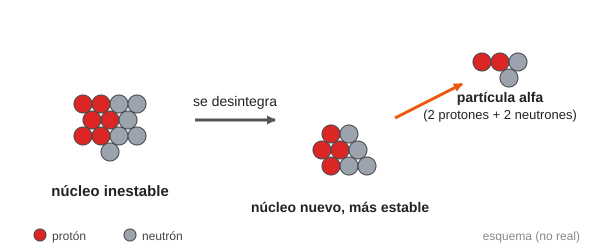
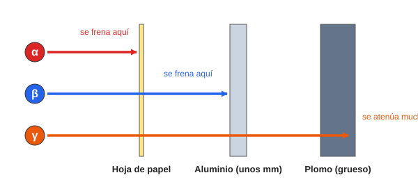
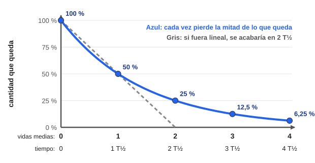
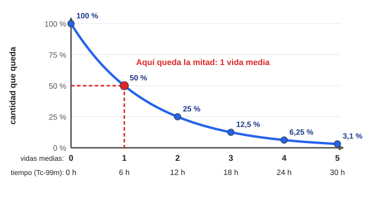
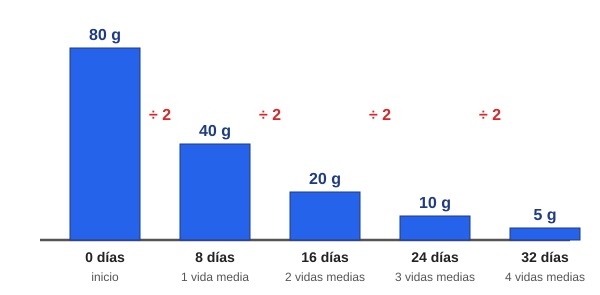
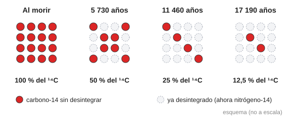
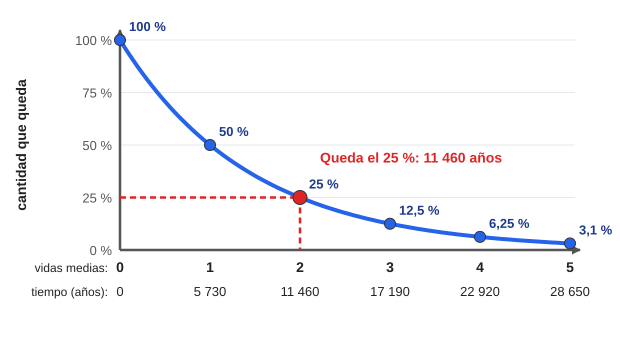
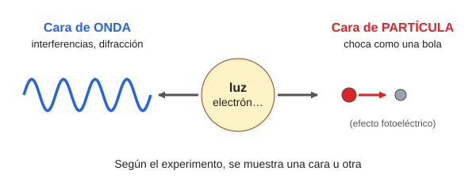

# Módulo 6. El núcleo inestable: radiactividad y radiación de partículas

*Cuando el núcleo cambia, la radiación sale disparada*

> **Al terminar este módulo sabrás:**
> 
> - Describir qué es la radiación de partículas y en qué se diferencia de la radiación electromagnética.
> - Explicar por qué un núcleo es radiactivo y qué cambia en él cuando emite radiación alfa, beta o gamma.
> - Calcular, usando la vida media, cuánta cantidad de una muestra radiactiva queda pasado un tiempo.
> - Explicar cómo se usa el carbono-14 para estimar la edad de una muestra.
> - Describir con tus palabras qué es la dualidad onda-corpúsculo.

---

## 6.1. Radiación de partículas: los proyectiles con masa

En el Módulo 5 vimos que los rayos X son ondas electromagnéticas: energía que vibra, **sin masa**. Pero hay otra forma de llevar energía a través del vacío: la **radiación de partículas**.

Aquí lo que viaja **no son ondas, sino trozos de materia** lanzados a gran velocidad. Es el «meteorito subatómico» del Módulo 2: cruza el espacio sin necesitar ningún medio y, cuando choca, **descarga su energía de movimiento** (energía cinética) contra lo que encuentra.

### ¿De qué están hechas estas «balas»?

| Partícula | Qué es |
| --- | --- |
| **Partícula alfa (α)** | Un **núcleo de helio**: 2 protones y 2 neutrones juntos |
| **Partícula beta (β)** | Un **electrón** (β⁻) o un **positrón** (β⁺) a gran velocidad. El positrón es como un electrón pero con carga positiva |
| **Neutrones** | Partículas del núcleo sin carga eléctrica, que viajan libres |
| **Otras** | Mesones π (piones), núcleos atómicos, fragmentos de fisión… |

Como tienen masa y, muchas de ellas, carga eléctrica, estas partículas chocan con los átomos del cuerpo y les **arrancan electrones**. Por eso son radiación **ionizante**.

> **Recuerda el Módulo 3:** las partículas **con carga** (alfa, beta) ionizan **directamente**. Los **neutrones**, sin carga, lo hacen de forma **indirecta**.

---

## 6.2. El núcleo inestable: radionucleidos y radiactividad

Los rayos X se producen **fuera del núcleo**. La radiación de partículas, en cambio, **nace en el núcleo**.

A veces un núcleo tiene una **mala proporción entre protones y neutrones**, o **demasiada energía**, o simplemente es **demasiado pesado**. Entonces es **inestable**.

**Analogía:** una torre de piezas de LEGO o de Jenga construida demasiado alta y torcida. No se va a quedar así para siempre: tarde o temprano se cae, y las piezas se recolocan en una forma más estable.

> **Dónde falla la analogía:** una torre se cae por una causa que podemos ver (un empujón, el viento). Un núcleo inestable se desintegra **por azar**, sin que nada lo empuje (lo veremos en el apartado 6.4).

Con las palabras del temario:

- A los núcleos inestables se les llama **radionucleidos** o **radioisótopos**.
- La transformación espontánea de uno de esos núcleos en otro más estable se llama **desintegración radiactiva**. El núcleo nuevo puede ser del **mismo elemento** o de **otro distinto**.
- A la propiedad de transformarse emitiendo radiación se le llama **radiactividad**.

Recuerda los **isótopos** del Módulo 1: el carbono-12 (6 protones y 6 neutrones) es estable. El **carbono-14** (6 protones y 8 neutrones) tiene dos neutrones de más, y por eso es radiactivo.

Desintegración alfa de un núcleo inestable

*Figura 1. Desintegración alfa. El núcleo inestable expulsa una partícula alfa (2 protones y 2 neutrones) y queda convertido en un núcleo nuevo y más estable.*

---

## 6.3. Cómo se desintegra un núcleo: alfa, beta y gamma

Un núcleo inestable puede soltar el exceso que le sobra de tres formas principales.

| Radiación | Qué sale | Cuándo ocurre | Qué le pasa al núcleo | Poder de ionización | Penetración |
| --- | --- | --- | --- | --- | --- |
| **Alfa (α)** | Un núcleo de helio (2 p + 2 n) | Núcleos muy pesados, con exceso de masa | Pierde 2 protones y 2 neutrones: **Z baja en 2 y A baja en 4** | **Muy alto** | **Muy baja** |
| **Beta menos (β⁻)** | Un electrón veloz | Exceso de **neutrones** | Un neutrón pasa a protón: **Z sube en 1**, A no cambia | Medio-bajo | Baja |
| **Beta más (β⁺)** | Un positrón | Exceso de **protones** | Un protón pasa a neutrón: **Z baja en 1**, A no cambia | Medio-bajo | Baja |
| **Gamma (γ)** | Un fotón de alta energía | Núcleo con **exceso de energía** (estado excitado) | **No cambia** ni Z ni A: solo pierde energía | Medio-bajo | **Muy alta** |

Detalles que conviene recordar:

- **El electrón de la radiación beta no sale de la corteza.** Se **forma en el núcleo** cuando un neutrón se transforma en protón.
- **La radiación alfa es «monoenergética»:** cada núcleo emite siempre su partícula alfa con la misma energía.
- **La gamma no es una partícula con masa, sino un fotón**, como el de los rayos X, pero que **sale del núcleo**. Por eso estudiamos las dos juntas: son radiaciones de origen nuclear.
- **Conversión interna:** a veces el núcleo excitado emite un fotón que no llega a salir del átomo: por el camino arranca un electrón de la corteza, que sale con mucha energía.

> **Nota:** en la desintegración beta sale también otra partícula casi sin masa (el neutrino), que no vamos a estudiar aquí.

### Ejemplos

| Desintegración | Transformación | Qué ha pasado |
| --- | --- | --- |
| **Alfa** | ²³⁸₉₂U → ²³⁴₉₀Th + α | El uranio pierde 2 protones y 2 neutrones y se convierte en torio. |
| **Beta menos** | ¹⁴₆C → ¹⁴₇N + e⁻ | Un neutrón del carbono-14 pasa a protón: ahora tiene 7 protones, es **nitrógeno-14**. |
| **Beta más** | ¹⁸₉F → ¹⁸₈O + e⁺ | Un protón del flúor-18 pasa a neutrón: ahora tiene 8 protones, es **oxígeno-18**. |
| **Gamma** | ⁹⁹ᵐTc → ⁹⁹Tc + γ | El núcleo no cambia de elemento: solo suelta energía. |

> **En el hospital:** el **flúor-18**, emisor de positrones, se usa en la tomografía por emisión de positrones (**PET**). El **tecnecio-99m**, emisor gamma, se usa en las gammagrafías.

### ¿Hasta dónde llega cada radiación?

Las tres atraviesan la materia de forma muy distinta. Esto es fundamental para la **protección radiológica**.

Poder de penetración de la radiación alfa, beta y gamma

*Figura 2. Poder de penetración. La alfa se frena con una hoja de papel, la beta con unos milímetros de aluminio y la gamma solo se atenúa mucho con materiales densos como el plomo.*

> **Idea clave:** la alfa ioniza muchísimo pero casi no penetra; la gamma penetra muchísimo y ioniza menos. Por eso la protección depende del tipo de radiación.

---

## 6.4. ¿Cuándo se desintegra un núcleo? El azar y la vida media

### El efecto «palomitas»

La desintegración es un proceso **puramente estadístico**. Con un átomo radiactivo es imposible saber **cuándo** se desintegrará: puede ser dentro de un segundo o dentro de un millón de años.

**Analogía:** las palomitas en el microondas. No puedes predecir qué grano concreto va a explotar en el segundo 15, pero sí sabes que, pasados unos minutos, casi toda la bolsa habrá explotado.

> **Dónde falla la analogía:** en las palomitas, el calor «empuja» a los granos a estallar. En un núcleo no hay ningún empujón: se desintegra solo, por azar.

Lo que sí podemos conocer es **la probabilidad**. Si tenemos muchísimos núcleos, el comportamiento del conjunto sí es predecible.

### La vida media (T½)

Cada radionucleido tiene un «reloj» propio. La forma más sencilla de medirlo es la **vida media**.

> **La vida media (T½) es el tiempo que tarda en desintegrarse la mitad de los núcleos de una muestra.**

Pasada **una vida media**, queda la **mitad**. Pasadas **dos**, queda **un cuarto**. Y así sucesivamente.

Cada radionucleido tiene la suya, que puede ir desde fracciones de segundo hasta miles de millones de años:

| Radionucleido | Vida media (T½) | Uso o interés |
| --- | --- | --- |
| Tecnecio-99m | ≈ 6 horas | Gammagrafías |
| Flúor-18 | ≈ 110 minutos | PET |
| Yodo-131 | ≈ 8 días | Tratamientos de tiroides |
| Carbono-14 | ≈ 5 730 años | Datación de restos antiguos |
| Uranio-238 | ≈ 4 500 millones de años | Natural, muy longevo |

> **En el hospital:** la vida media decide cuánto tiempo se puede usar un radiofármaco y cuánto tiempo emite radiación el paciente.

---

## 6.5. Cómo disminuye una muestra: la función exponencial sin miedo

Aquí viene la parte con números. **Te basta con saber multiplicar y dividir por 2.** Vamos paso a paso.

### Paso 1: la regla «la mitad de lo que queda»

Imagina que tienes **80 gramos** de un radionucleido con una vida media de **8 días**.

- Tras **8 días** (1 vida media), queda la mitad: **40 g**.
- Tras **16 días** (2 vidas medias), queda la mitad de 40: **20 g**.
- Tras **24 días** (3 vidas medias), queda la mitad de 20: **10 g**.

Fíjate en que **cada vez se pierde la mitad de lo que queda**, no la misma cantidad: primero se pierden 40 g, luego 20 g, luego 10 g. Cada vez se pierde menos.

A este tipo de disminución se le llama **exponencial**.

### Paso 2: ¿en qué se diferencia de una bajada «normal»?

Una bajada **lineal** perdería **la misma cantidad** cada vez (por ejemplo, 40 g cada 8 días): en 16 días se habría acabado todo. En la desintegración, en cambio, **cada vez se pierde menos y nunca llega exactamente a cero**.

Comparación entre una bajada lineal y una exponencial

*Figura 3. Bajada lineal (gris) frente a bajada exponencial (azul). En la lineal la cantidad se acaba pronto; en la exponencial va quedando cada vez menos, pero nunca llega a cero.*

### Paso 3: la gráfica

Esta es la **curva de desintegración**. El eje horizontal cuenta las vidas medias que han pasado y el vertical, qué porcentaje queda.

Curva de desintegración radiactiva

*Figura 4. Curva de desintegración. Cada vida media la cantidad se reduce a la mitad. Los tiempos de la fila inferior son los del tecnecio-99m (T½ = 6 horas).*

### Paso 4: la «chuleta» de las mitades

El número de vidas medias que han pasado se llama **n**. La fracción que queda es **½ multiplicado por sí mismo n veces**:

| Vidas medias (n) | Cuenta | Fracción que queda | Porcentaje |
| --- | --- | --- | --- |
| 0 | — | 1 | 100 % |
| 1 | ½ | 1/2 | 50 % |
| 2 | ½ × ½ | 1/4 | 25 % |
| 3 | ½ × ½ × ½ | 1/8 | 12,5 % |
| 4 | ½ × ½ × ½ × ½ | 1/16 | 6,25 % |
| 5 |  | 1/32 | ≈ 3,1 % |
| 10 |  | 1/1 024 | menos del 0,1 % |

> **Dato útil:** pasadas unas 10 vidas medias, queda aproximadamente una milésima parte. Es decir, su actividad es ya unas mil veces menor que al principio.

### Cómo se calcula, en cuatro pasos

1. Busca la **vida media (T½)** del radionucleido.
2. Calcula **n = tiempo transcurrido ÷ T½** (cuántas vidas medias han pasado).
3. Calcula la **fracción que queda = ½ multiplicado n veces**. Si n no es un número entero, usa la calculadora con la tecla de elevar: **0,5 ^ n**.
4. **Cantidad que queda = cantidad inicial × fracción.**

En una sola fórmula:

> **N = N₀ · (½)ⁿ** con **n = t / T½** (N₀ = cantidad inicial; N = cantidad que queda; t = tiempo transcurrido)

### Ejemplos resueltos

#### Ejemplo 1: gramos que quedan

**80 g de un radionucleido con T½ = 8 días. ¿Cuánto queda a los 24 días?**

1. T½ = 8 días.
2. n = 24 / 8 = **3** vidas medias.
3. Fracción = ½ × ½ × ½ = **1/8**.
4. Queda = 80 × 1/8 = **10 g**.

Gramos que quedan de una muestra cada 8 días

*Figura 5. Gramos que quedan de la muestra del ejemplo 1: cada 8 días, la mitad.*

#### Ejemplo 2: actividad de una dosis de tecnecio-99m

Un paciente recibe una dosis con una **actividad de 600 MBq** de tecnecio-99m (T½ = 6 h). **¿Qué actividad queda a las 24 horas?**

1. T½ = 6 h.
2. n = 24 / 6 = **4** vidas medias.
3. Fracción = 1/16.
4. Actividad = 600 × 1/16 = **37,5 MBq**.

En la gráfica de la Figura 4 puedes comprobarlo: a las 24 h (n = 4) queda el 6,25 %.

> **Qué es un MBq:** un becquerel (Bq) es una desintegración por segundo, y 1 MBq son un millón de Bq. La actividad se explica en el apartado 6.6 y las unidades, en el Módulo 8.

#### Ejemplo 3: cuando n no es un número entero

**Con la misma dosis de 600 MBq, ¿qué actividad queda a las 9 horas?**

1. n = 9 / 6 = **1,5** vidas medias.
2. Con calculadora: 0,5 ^ 1,5 ≈ **0,354**.
3. Actividad = 600 × 0,354 ≈ **212 MBq**.

Cuadra con la gráfica: 1,5 vidas medias está entre el 50 % y el 25 %, es decir, entre 300 y 150 MBq.

#### Ejemplo 4: ¿cuánto tiempo tiene que pasar?

**¿Cuánto tarda el tecnecio-99m en bajar a 1/8 de su valor?**

- 1/8 = ½ × ½ × ½, es decir, **n = 3** vidas medias.
- Tiempo = 3 × 6 h = **18 horas**.

> **Para ir más allá: la fórmula con la «e»**
> 
> En física, la ley de desintegración se suele escribir así:
> 
> **N = N₀ · e^(−λt)**
> 
> donde **e ≈ 2,718** es un número especial de las matemáticas y **λ** (lambda) es la **constante de desintegración**: la probabilidad por unidad de tiempo de que un núcleo concreto se desintegre. Se mide en **s⁻¹** (por segundo). No hay que confundirla con los hercios, que se reservan para ondas.
> 
> Es **exactamente lo mismo** que N = N₀ · (½)ⁿ. Las dos están relacionadas por:
> 
> **λ = 0,693 / T½**
> 
> Por ejemplo, para el tecnecio-99m (T½ = 6 h): λ = 0,693 / 6 ≈ 0,12 por hora.

---

## 6.6. La actividad: el ritmo de los disparos

Para un técnico de hospital, lo importante no es cuántos átomos hay, sino **cuántas desintegraciones (disparos de radiación) ocurren por segundo**. A eso se le llama **actividad (A)**.

> **Unidad:** el **becquerel (Bq)**. **1 Bq = 1 desintegración por segundo.** Sus múltiplos son el kBq (mil) y el MBq (un millón).

La actividad depende de dos cosas: cuántos núcleos inestables hay (**N**) y la probabilidad de que cada uno se desintegre (**λ**):

> **A = λ · N**

**Ejemplo:** una muestra tiene 2 000 000 de núcleos y la probabilidad de que cada uno se desintegre es de 0,001 por segundo.

- A = 0,001 × 2 000 000 = **2 000 desintegraciones por segundo = 2 000 Bq**.

### La actividad también disminuye a la mitad cada vida media

Como cada vez quedan menos núcleos, **la actividad baja** igual que la cantidad: se divide por 2 cada vida media.

> **A = A₀ · (½)ⁿ** con **n = t / T½**

(En la versión con la «e», **A = A₀ · e^(−λt)**.)

> **Idea clave: el mito de la radiación eterna.** Mucha gente piensa que una muestra radiactiva emite siempre lo mismo. Es falso: como cada vez quedan menos núcleos inestables, **su actividad va bajando con el tiempo**. Eso sí, si la vida media es muy larga (miles de millones de años), el descenso es imperceptible en una vida humana.

---

## 6.7. El carbono-14: un reloj para medir el pasado

La vida media sirve para algo muy distinto de un hospital: **calcular la edad de objetos antiguos**. Es la **datación por carbono-14**.

### Cómo funciona

1. **En la atmósfera** se forma de manera continua carbono-14 radiactivo, que se mezcla con el carbono normal (carbono-12) del dióxido de carbono del aire.
2. **Los seres vivos** (plantas, animales, personas) incorporan carbono del aire y de los alimentos. Mientras viven, **su proporción de carbono-14 es siempre la misma que la de la atmósfera**: aproximadamente 1 átomo de carbono-14 por cada billón de átomos de carbono.
3. **Al morir**, el organismo **deja de incorporar carbono**. El carbono-12 se queda como estaba, pero el **carbono-14 va desintegrándose** (se convierte en nitrógeno-14) con una vida media de **5 730 años**, y nada lo repone.
4. **Se mide** qué fracción de carbono-14 queda en la muestra respecto a un ser vivo. Con esa fracción sabemos cuántas vidas medias han pasado y, multiplicando por 5 730 años, **la edad**.

Núcleos de carbono-14 que quedan tras la muerte

*Figura 6. Los núcleos de carbono-14 de un hueso o de un trozo de madera tras la muerte. Cada 5 730 años se desintegra la mitad de los que quedaban (esquema, no a escala).*

### La tabla de edades

| Fracción de carbono-14 que queda | Vidas medias | Edad de la muestra |
| --- | --- | --- |
| 100 % | 0 | Acaba de morir |
| 50 % | 1 | 5 730 años |
| 25 % | 2 | 11 460 años |
| 12,5 % | 3 | 17 190 años |
| 6,25 % | 4 | 22 920 años |
| ≈ 3,1 % | 5 | 28 650 años |

Curva de desintegración del carbono-14

*Figura 7. Curva de desintegración del carbono-14. Si en una muestra queda el 25 % del carbono-14, han pasado 2 vidas medias: 11 460 años.*

### Ejemplos resueltos

#### Ejemplo 5: un hueso con el 25 %

**En un hueso se mide una cuarta parte del carbono-14 que tendría un hueso reciente. ¿Qué edad tiene?**

1. 25 % = 1/4 = ½ × ½, es decir, **n = 2** vidas medias.
2. Edad = 2 × 5 730 = **11 460 años**.

#### Ejemplo 6: un trozo de madera con el 12,5 %

**¿Qué edad tiene?**

1. 12,5 % = 1/8, es decir, **n = 3**.
2. Edad = 3 × 5 730 = **17 190 años**.

#### Ejemplo 7: una fracción que no es «redonda»

**¿Y si queda el 70 %?** No es una potencia exacta de ½. Se puede **leer en la gráfica**: el 70 % corresponde a algo más de media vida media, es decir, **unos 3 000 años**.

> **Para ir más allá: el cálculo exacto**
> 
> Para fracciones que no son redondas se usa un logaritmo neperiano (la tecla **ln** de la calculadora):
> 
> **t = (T½ / 0,693) · ln(N₀ / N)**
> 
> Para el 70 %: N₀ / N = 1 / 0,7 ≈ 1,43 → ln ≈ 0,357 → t = (5 730 / 0,693) · 0,357 ≈ **2 950 años**. Coincide con lo que leíamos en la gráfica.

### Qué hay que tener en cuenta

- **Solo sirve para restos que fueron seres vivos** (hueso, madera, carbón, tela…). No sirve para datar una roca o un metal.
- **Tiene un límite de unos 50 000 años:** pasado ese tiempo queda aproximadamente un 0,2 % del carbono-14, demasiado poco para medirlo con fiabilidad.
- Se asume que la proporción de carbono-14 en la atmósfera era siempre la misma, y por eso los resultados se **corrigen con curvas de calibración**.

> **En el hospital:** aquí se usa el carbono-14, con una vida media enorme. En un servicio de medicina nuclear se usan radionucleidos de vida media corta (horas), pero **el razonamiento y las cuentas son exactamente los mismos**.

---

## 6.8. La dualidad onda-corpúsculo: cuando las etiquetas se difuminan

Hemos separado la radiación en **ondas** (electromagnética) y **partículas** (alfa, beta…). Esta división viene de la física clásica, que veía las dos cosas como mundos distintos:

- **Partículas (corpúsculos):** tienen masa y una posición bien definida, como una bola de billar.
- **Ondas:** vibraciones sin masa que se extienden por el espacio.

### Un debate de siglos: ¿qué es la luz?

| Quién | Qué defendía | Prueba a su favor |
| --- | --- | --- |
| **Isaac Newton** (s. XVII) | La luz es un chorro de **partículas** | Explicaba muy bien el rebote (la reflexión) |
| **Christiaan Huygens** (s. XVII) | La luz es una **onda** | Explicaba otros fenómenos; más tarde, Thomas Young vio que la luz forma **interferencias**, como las olas del mar |
| **Albert Einstein** (1905) | La luz, a veces, se comporta como **partículas** (fotones) | **Efecto fotoeléctrico:** la luz arranca electrones de un metal como si chocaran bolas |

Entonces, ¿es la luz una onda o una partícula?

### La respuesta de De Broglie (1924)

**Louis de Broglie** dio la respuesta: **las dos cosas**. Es el **principio de la dualidad onda-corpúsculo**: la luz tiene características de onda y de partícula, y **muestra una cara u otra según el experimento** que hagamos.

Dualidad onda-corpúsculo

*Figura 8. La dualidad onda-corpúsculo: según el experimento, la luz (o un electrón) se comporta como onda o como partícula.*

Y De Broglie fue más lejos: **si la luz, que es onda, puede comportarse como partícula, la materia también puede comportarse como onda.** A esas ondas asociadas a la materia las llamó **ondas de materia**.

Para unir los dos mundos propuso una fórmula que relaciona la longitud de onda (λ, propia de las ondas) con la cantidad de movimiento (p, propia de las partículas):

> **λ = h / p**

- **p = masa × velocidad** (la «cantidad de movimiento»).
- **h** es la **constante de Planck**: el «puente» entre el mundo de las ondas y el de las partículas.

**¿Cómo se interpreta?** Cuanta más masa y más velocidad tiene algo, **más pequeña** es su longitud de onda. Una pelota de tenis tiene una longitud de onda tan minúscula que **nunca se nota**. Un electrón, en cambio, tiene una longitud de onda parecida al tamaño de un átomo, y **sí se nota**.

> **Idea clave:** a escala microscópica, «onda» y «partícula» son dos caras de lo mismo. Un fotón de rayos X (Módulo 5) y un electrón veloz tienen una doble identidad. Esta idea es la base de la **física cuántica**, que está detrás de muchas tecnologías médicas, entre ellas la resonancia magnética.

---

## Resumen del módulo

- La **radiación de partículas** son «balas» con masa: alfa (núcleos de helio), beta (electrones o positrones), neutrones… Ioniza al chocar.
- Un núcleo **inestable** (radionucleido) se **desintegra** espontáneamente en otro más estable: es la **radiactividad**.
- **Alfa:** Z baja 2 y A baja 4 (ioniza mucho, penetra poco). **Beta:** cambia un neutrón por un protón (β⁻) o al revés (β⁺). **Gamma:** el núcleo suelta energía y no cambia (penetra mucho).
- La desintegración es **aleatoria**, pero con muchos núcleos es predecible. La **vida media (T½)** es el tiempo en que se desintegra la mitad.
- La cantidad y la **actividad** bajan **exponencialmente**: **N = N₀ · (½)ⁿ**, con **n = t / T½**. Nunca llegan exactamente a cero.
- **Actividad:** A = λ · N, en **becquerelios** (1 Bq = 1 desintegración por segundo).
- El **carbono-14** (T½ = 5 730 años) permite **datar** restos de seres vivos hasta unos 50 000 años.
- **Dualidad onda-corpúsculo:** la luz y la materia pueden comportarse como onda o como partícula. **λ = h / p**.

## Glosario

| Término | Significado |
| --- | --- |
| **Radiación de partículas** | Energía transportada por partículas con masa. |
| **Partícula alfa (α)** | Núcleo de helio (2 protones + 2 neutrones). |
| **Partícula beta (β)** | Electrón (β⁻) o positrón (β⁺) emitido por un núcleo. |
| **Positrón** | Partícula igual al electrón pero con carga positiva. |
| **Radionucleido (radioisótopo)** | Núcleo inestable que se desintegra. |
| **Desintegración radiactiva** | Transformación espontánea de un núcleo inestable en otro. |
| **Radiactividad** | Propiedad de emitir radiación al desintegrarse. |
| **Vida media (T½)** | Tiempo en que se desintegra la mitad de los núcleos de una muestra. |
| **Desintegración exponencial** | Disminución en la que cada vez se pierde la mitad de lo que queda. |
| **Actividad (A)** | Número de desintegraciones por segundo de una muestra. |
| **Becquerel (Bq)** | Unidad de actividad: 1 desintegración por segundo. |
| **Constante de desintegración (λ)** | Probabilidad por unidad de tiempo de que un núcleo se desintegre. |
| **Datación por carbono-14** | Método para estimar la edad de restos orgánicos a partir del carbono-14 que les queda. |
| **Dualidad onda-corpúsculo** | Idea de que la luz y la materia se comportan a veces como onda y a veces como partícula. |
| **Ondas de materia** | Ondas asociadas a las partículas materiales (De Broglie). |
| **Cantidad de movimiento (p)** | Masa × velocidad de una partícula. |
| **Constante de Planck (h)** | Constante que relaciona el mundo de las ondas y el de las partículas. |

---

## Ejercicios propuestos

1. Un núcleo de uranio-238 (Z = 92) emite una partícula alfa. ¿Qué número atómico (Z) y qué número másico (A) tiene el núcleo que resulta? ¿De qué elemento se trata?
2. El carbono-14 se desintegra por beta menos y se convierte en nitrógeno-14. ¿Cuántos protones y cuántos neutrones tiene el nitrógeno-14?
3. Una muestra de un radionucleido tiene una actividad de 120 MBq y una vida media de 4 horas. ¿Qué actividad tendrá a las 12 horas?
4. El tecnecio-99m tiene una vida media de 6 horas. ¿Cuánto tiempo tiene que pasar para que su actividad baje a una cuarta parte?
5. En un trozo de madera antigua queda el 12,5 % del carbono-14 que tendría una madera reciente. ¿Qué edad tiene?
6. Verdadero o falso, y justifica: a) «Una muestra radiactiva emite siempre la misma radiación». b) «Si la vida media es de 8 días, a los 16 días ya no queda nada de muestra». c) «Los electrones también pueden comportarse como ondas».

## Soluciones

1. La alfa se lleva 2 protones y 2 neutrones: Z = 92 − 2 = **90** y A = 238 − 4 = **234**. Con Z = 90, el elemento es **torio** (²³⁴₉₀Th).
2. El nitrógeno tiene Z = 7, así que **7 protones**. Como A = 14, N = 14 − 7 = **7 neutrones**.
3. n = 12 / 4 = 3 vidas medias. Fracción = 1/8. Actividad = 120 × 1/8 = **15 MBq**.
4. Una cuarta parte = ½ × ½, es decir, n = 2. Tiempo = 2 × 6 h = **12 horas**.
5. 12,5 % = 1/8, es decir, n = 3. Edad = 3 × 5 730 = **17 190 años**.
6. a) **Falso.** La actividad disminuye con el tiempo porque cada vez quedan menos núcleos inestables. b) **Falso.** A los 16 días han pasado 2 vidas medias y queda **1/4** (el 25 %). Nunca queda exactamente cero. c) **Verdadero.** Según De Broglie, toda partícula tiene una onda asociada (λ = h / p).

---

**Siguiente módulo:** hemos visto la radiación ionizante (rayos X y radiación nuclear). El Módulo 7 trata del **magnetismo** y de la **radiación no ionizante en imagen**, empezando por cómo se comportan los materiales ante un campo magnético, la base de la **resonancia magnética**.