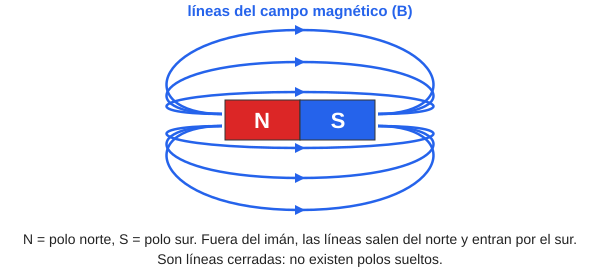
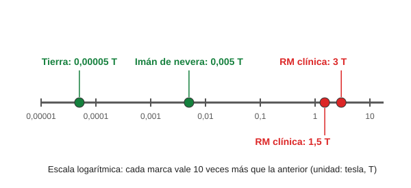
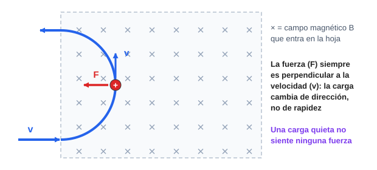
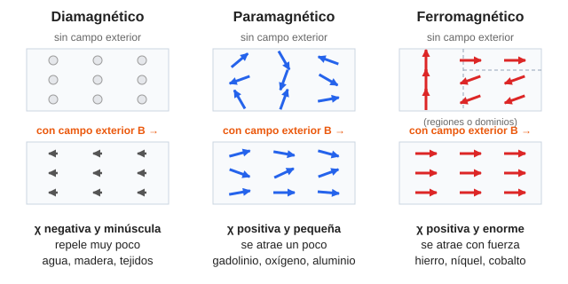
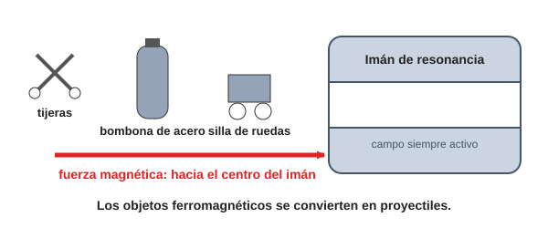

# Módulo 7. El magnetismo

*El motor invisible de la resonancia magnética*

> **Al terminar este módulo sabrás:**
> 
> - Explicar de dónde sale el magnetismo y por qué un trozo de hierro se pega a un imán y la madera no.
> - Describir qué es un campo magnético, cómo se representa y en qué unidad se mide.
> - Explicar qué fuerza sufre una carga que se mueve dentro de un campo magnético.
> - Distinguir los materiales diamagnéticos, paramagnéticos y ferromagnéticos.
> - Enumerar los riesgos del magnetismo en una sala de resonancia magnética.

---

## 7.1. El origen del magnetismo: el átomo como brújula

Desde la Antigüedad se conoce la **magnetita**, una piedra capaz de atraer el hierro (se conoce desde hace unos 3 000 años). Hoy definimos el **magnetismo** como la propiedad de algunos materiales de producir un **campo magnético** a su alrededor. A los objetos que lo hacen los llamamos **imanes**.

> **Recuerda el Módulo 5:** un **campo** es una zona del espacio donde se nota una influencia a distancia, sin tocar. Un imán atrae un clip sin tocarlo.

### ¿De dónde sale esa fuerza invisible?

De las **cargas eléctricas en movimiento**.

Como vimos en el Módulo 1, los átomos tienen **electrones** (cargas negativas) moviéndose alrededor del núcleo. Un electrón en movimiento es como una **minúscula corriente eléctrica**, y toda corriente genera un campo magnético. Así, cada átomo se comporta como un **diminuto imán**, al que llamamos **dipolo magnético atómico**.

**Analogía:** cada átomo es una **brújula diminuta**.

> **Dónde falla la analogía:** una brújula de verdad es un objeto grande y se orienta por el campo de la Tierra. El dipolo de un átomo es una propiedad suya, y su origen es cuántico. Pero la imagen de «brújula que se orienta» funciona muy bien para entender el resto del módulo.

El dipolo magnético es para el magnetismo lo que la **masa** es para la gravedad o la **carga** para la electricidad: la propiedad que lo origina.

### ¿Por qué no todo es un imán?

- En la **inmensa mayoría** de los materiales, las «brújulas» de los electrones apuntan en **direcciones opuestas** y **se anulan** entre sí. El resultado global es **cero**. Por eso una mesa de plástico no atrae clips.
- En **unos pocos elementos** (hierro, níquel, cobalto), las brújulas se organizan para que sus campos **se sumen**. Ahí nace un imán.

### Dos cosas más que conviene saber

- **Una corriente eléctrica en un cable crea un campo magnético.** Si el cable se enrolla en una bobina, el campo se concentra y se obtiene un **electroimán**.
- **Los imanes de las resonancias** son electroimanes superconductores: sus bobinas se enfrían a unos −269 °C para que la corriente circule sin resistencia.

---

## 7.2. El campo magnético

### Cómo se representa: las líneas de campo

El campo magnético se representa con la letra **B**. Para visualizarlo se dibujan **líneas de campo**, que indican la dirección del campo en cada punto.

Líneas de campo de un imán de barra

*Figura 1. Líneas de campo de un imán de barra. Salen del polo norte y entran por el polo sur.*

Reglas importantes:

- Fuera del imán, las líneas **salen del polo norte y entran por el polo sur**.
- Todo imán tiene **dos polos**, norte y sur. **Si cortas un imán por la mitad, obtienes dos imanes más pequeños**, cada uno con sus dos polos. No se pueden separar.
- Cuanto **más juntas** están las líneas, **más intenso** es el campo.

### Cómo se mide: el tesla

El campo magnético se mide en **teslas (T)**.

Carga en movimiento dentro de un campo magnético

*Figura 2. Algunos campos magnéticos comunes, en escala logarítmica (cada marca vale 10 veces más que la anterior).*

| Campo | Valor aproximado |
| --- | --- |
| Campo magnético de la **Tierra** | 0,00005 T |
| **Imán de nevera** | 0,005 T |
| **Resonancia magnética clínica** | **1,5 T o 3 T** |

> **Dato útil:** un imán de resonancia de 1,5 T es **unas 30 000 veces más intenso** que el campo magnético de la Tierra.
> 
> Antiguamente se usaba el **gauss (G)**: 1 T = 10 000 G.

> **Idea clave:** el campo magnético **no es radiación ni «viaja»** como una onda. Un campo estático es una zona del espacio donde hay una influencia magnética. No ioniza.

### La fuerza magnética sobre una carga en movimiento

Cuando una **partícula con carga** se mueve dentro de un campo magnético, **sufre una fuerza**: la **fuerza magnética**. Depende de tres cosas:

- la **carga** de la partícula (q),
- su **velocidad** (v),
- la **intensidad del campo** (B).

Cuando la partícula se mueve perpendicularmente al campo:

> **F = q · v · B**

Más carga, más velocidad o más campo significan más fuerza.

Escala de campos magnéticos en teslas

*Figura 3. Una carga positiva entra en un campo magnético que apunta hacia dentro de la hoja. La fuerza (rojo) es siempre perpendicular a la velocidad (azul) y la hace girar.*

Tres cosas curiosas sobre esta fuerza:

1. **Es siempre perpendicular** a la velocidad y al campo.
2. **No acelera ni frena** la partícula: solo **cambia su dirección**. Por eso la carga describe una **circunferencia**.
3. **Una carga quieta no siente nada.** Solo actúa sobre cargas en movimiento.

> **Para ir más allá: la fórmula completa**
> 
> Si la partícula no se mueve exactamente perpendicular al campo, la fuerza es **F = q · v · B · sen θ**, donde **θ** es el ángulo entre la velocidad y el campo. Si la partícula se mueve **en la misma dirección** que el campo, **no sufre ninguna fuerza**.
> 
> En física se escribe con una operación entre vectores (el **producto vectorial**), y la dirección de la fuerza se encuentra con la **regla de la mano derecha**.
> 
> Esta fórmula también sirve para **definir el tesla**: 1 T es el campo que ejerce una fuerza de 1 N sobre una carga de 1 C que se mueve a 1 m/s perpendicularmente al campo.

---

## 7.3. ¿Cómo reacciona la materia? La susceptibilidad magnética

Si metes un material (o un paciente) dentro de un campo magnético intenso, como el de una resonancia, los átomos **reaccionan**.

La **susceptibilidad magnética (χ)**, letra griega «ji», mide **cuánto se deja influenciar** un material por un campo exterior, es decir, cuánto campo magnético se genera en su interior.

Según el valor de χ, los materiales se clasifican en **tres grupos principales**:

Materiales diamagnéticos, paramagnéticos y ferromagnéticos

*Figura 4. Los tres tipos de materiales, sin campo exterior (arriba) y con campo exterior (abajo). Cada flecha es el dipolo magnético de un átomo.*

### 1. Diamagnéticos: los indiferentes

- **Susceptibilidad:** χ **negativa y minúscula** (χ \< 0).
- **Qué hacen:** casi no responden al campo. Si acaso, **lo repelen muy ligeramente**: el campo induce en ellos dipolos diminutos en sentido contrario.
- **Sus átomos** no tienen un dipolo magnético permanente (los electrones se anulan entre sí).
- **Ejemplos:** la **inmensa mayoría de las sustancias**: **agua, madera, plástico y casi todos los tejidos del cuerpo humano**.

### 2. Paramagnéticos: los que se dejan llevar

- **Susceptibilidad:** χ **positiva y pequeña** (χ > 0).
- **Qué hacen:** sus átomos sí tienen un dipolo permanente, pero están desordenados. En presencia de un imán, las «brújulas» **se alinean un poco con el campo**, lo que refuerza el campo en su interior. Son **atraídos débilmente**.
- **Al quitar el campo**, vuelven al desorden y no se quedan imantados.
- **Ejemplos:** **gadolinio**, oxígeno, aluminio.

> **En el hospital: el gadolinio (Gd).** Es paramagnético. Se inyecta como **contraste** en las resonancias. No es que «brille» él mismo: modifica el comportamiento magnético de los tejidos que tiene cerca y hace que **destaquen** en la imagen. Veremos cómo en el módulo de resonancia magnética.

### 3. Ferromagnéticos: los fanáticos

- **Susceptibilidad:** χ **positiva y enorme** (χ ≫ 0).
- **Son un grupo aparte**, no un «tipo de paramagnéticos»: sus átomos **se influyen entre sí** y se organizan en bloques llamados **dominios**. Dentro de cada dominio, todos los dipolos apuntan igual.
- **Sin campo exterior**, cada dominio apunta a un lado distinto y el conjunto no se nota como imán.
- **Con campo exterior**, los dominios **se alinean casi todos a la vez**, y el material es atraído con **mucha fuerza**.
- **Al quitar el campo**, algunos materiales **se quedan imantados**: son los **imanes permanentes**.
- **Ejemplos:** **hierro, níquel y cobalto**, además de la magnetita.

### Comparación

|  | **Diamagnéticos** | **Paramagnéticos** | **Ferromagnéticos** |
| --- | --- | --- | --- |
| **Susceptibilidad (χ)** | Negativa y minúscula | Positiva y pequeña | Positiva y enorme |
| **Frente a un imán** | Repele muy poco | Se atrae un poco | Se atrae con fuerza |
| **Al quitar el campo** | Nada | Se desordena | Puede quedar imantado |
| **Ejemplos** | Agua, madera, tejidos | Gadolinio, oxígeno, aluminio | Hierro, níquel, cobalto |

> **Nota:** en la naturaleza hay otros comportamientos más raros (antiferromagnetismo, ferrimagnetismo). Para este curso, estos tres grupos bastan.

---

## 7.4. Seguridad en la sala de resonancia magnética

Esto es lo más importante del módulo para tu trabajo.

> **Advertencia de seguridad:** el imán de una resonancia está **siempre encendido**, incluso cuando no hay ningún paciente dentro. El campo no se «apaga» al terminar la jornada.

Los **materiales ferromagnéticos** son el mayor peligro. La fuerza magnética los atrae con tanta violencia que se convierten en **proyectiles** hacia el centro del imán. Es el llamado **efecto proyectil**.

Efecto proyectil en la sala de resonancia

*Figura 5. Efecto proyectil. Un objeto ferromagnético que entra en la sala es atraído hacia el imán con gran fuerza.*

### Qué no debe entrar en la sala

| Objeto | Riesgo |
| --- | --- |
| **Tijeras, herramientas, llaves** | Proyectiles |
| **Bombonas de oxígeno de acero** | Proyectil muy pesado; pueden ser mortales |
| **Sillas de ruedas, camillas, carros** que no sean amagnéticos | Proyectiles |
| **Teléfono móvil, tarjetas, relojes** | Se dañan |
| **Marcapasos y algunos implantes** | Pueden funcionar mal o desplazarse |
| **Cuerpos extraños metálicos en el paciente** (esquirlas, balas, clips) | Pueden moverse y causar lesiones |

> **En el hospital:** antes de cada resonancia se pasa un **cuestionario de seguridad** al paciente y se comprueba que no lleva nada metálico. Los implantes se consultan siempre con el fabricante o el protocolo del centro. **Nunca se improvisa**.

---

## Resumen del módulo

- El **magnetismo** nace de las **cargas eléctricas en movimiento**. Cada átomo es un **dipolo magnético** (una «brújula»).
- En la mayoría de los materiales, las brújulas **se anulan**. En el hierro, el níquel y el cobalto, **se suman**.
- El **campo magnético (B)** se representa con **líneas de campo** (salen del norte y entran por el sur) y se mide en **teslas (T)**. Una resonancia clínica usa 1,5 T o 3 T.
- Una carga **en movimiento** en un campo sufre la **fuerza magnética**: **F = q · v · B** (si es perpendicular). Es perpendicular a la velocidad y solo cambia la dirección.
- La **susceptibilidad magnética (χ)** mide cuánto responde un material:
  - **Diamagnéticos** (χ \< 0, minúscula): agua, madera, tejidos.
  - **Paramagnéticos** (χ > 0, pequeña): gadolinio, oxígeno, aluminio.
  - **Ferromagnéticos** (χ ≫ 0, enorme): hierro, níquel, cobalto. Pueden ser **imanes permanentes**.
- El imán de una resonancia está **siempre activo**: los objetos ferromagnéticos son **proyectiles**.

## Glosario

| Término | Significado |
| --- | --- |
| **Magnetismo** | Propiedad de algunos materiales de generar un campo magnético. |
| **Imán** | Objeto que genera un campo magnético. |
| **Dipolo magnético** | «Brújula» diminuta asociada a un átomo. |
| **Campo magnético (B)** | Zona del espacio donde se nota la influencia de un imán o de cargas en movimiento. |
| **Líneas de campo** | Líneas que representan la dirección del campo. |
| **Tesla (T)** | Unidad del campo magnético. |
| **Fuerza magnética** | Fuerza que sufre una carga que se mueve dentro de un campo. |
| **Susceptibilidad magnética (χ)** | Medida de cuánto se magnetiza un material en presencia de un campo. |
| **Diamagnético** | Material con χ negativa y minúscula; repele muy poco. |
| **Paramagnético** | Material con χ positiva y pequeña; se atrae un poco. |
| **Ferromagnético** | Material con χ positiva y enorme; puede quedar imantado. |
| **Dominio magnético** | Región de un material ferromagnético donde todos los dipolos apuntan igual. |
| **Electroimán** | Imán creado por una corriente eléctrica en una bobina. |
| **Efecto proyectil** | Atracción violenta de un objeto ferromagnético hacia el imán. |

---

## Ejercicios propuestos

1. ¿Por qué un trozo de hierro se pega a un imán y una pieza de madera no? Responde con las palabras «dipolo» y «alinear».
2. ¿Cuántas veces es más intenso un campo de 3 T que el de un imán de nevera de 0,005 T?
3. Una partícula con carga positiva entra en un campo magnético. ¿Qué pasa con su velocidad (rapidez) y con su dirección?
4. Clasifica en diamagnético, paramagnético o ferromagnético: a) agua, b) hierro, c) gadolinio, d) tejido muscular, e) aluminio.
5. ¿Por qué un material ferromagnético puede convertirse en imán permanente y uno paramagnético no?
6. Un compañero entra en la sala de resonancia con unas tijeras de acero porque «el imán está apagado». ¿Qué le dirías?
7. Verdadero o falso, y justifica: a) «El campo magnético ioniza los tejidos». b) «Si cortas un imán por la mitad, obtienes un polo norte y un polo sur separados». c) «Una carga en reposo siente una fuerza magnética».

## Soluciones

1. El hierro tiene **dipolos** magnéticos que se **alinean** con el campo del imán, así que se atrae con fuerza. En la madera los dipolos se anulan y casi no responde.
2. 3 / 0,005 = **600 veces**.
3. La **rapidez no cambia**; solo cambia la **dirección**, y describe una circunferencia.
4. a) **Diamagnético.** b) **Ferromagnético.** c) **Paramagnético.** d) **Diamagnético.** e) **Paramagnético.**
5. En un ferromagnético los dipolos están organizados en **dominios** y, al quitar el campo, muchos se quedan alineados. En un paramagnético se desordenan al quitarlo.
6. Que el imán **está siempre encendido**: las tijeras serían un proyectil. No pueden entrar.
7. a) **Falso.** El campo magnético estático no es radiación ionizante. b) **Falso.** Se obtienen **dos imanes**, cada uno con sus dos polos. c) **Falso.** Una carga quieta no siente fuerza magnética.

---

**Siguiente módulo:** ya conocemos las ondas, la radiación ionizante y el magnetismo. Para poder medir todo esto y comparar unas radiaciones con otras necesitamos las **magnitudes y unidades** de la radiación (actividad, dosis…), que será el siguiente módulo.