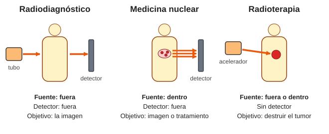
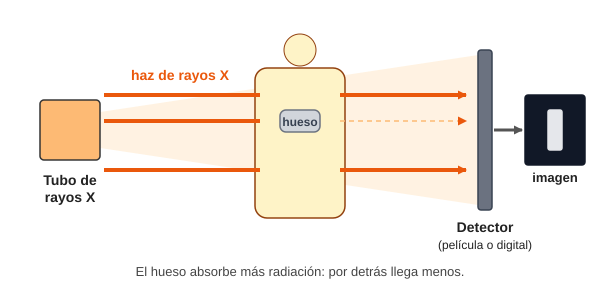
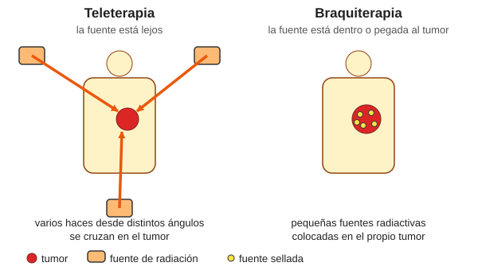
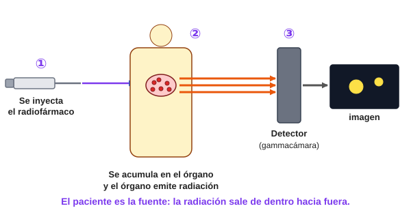

# Módulo 8. Aplicaciones en el hospital

*De la física teórica a la sala de pacientes*

> **Al terminar este módulo sabrás:**
> 
> - Diferenciar radiodiagnóstico, medicina nuclear y radioterapia.
> - Indicar en cada técnica de dónde sale la radiación y dónde está el detector o el objetivo.
> - Relacionar cada técnica con el tipo de radiación que usa (rayos X, radiación gamma o partículas) y con los módulos anteriores.
> - Citar ejemplos de equipos y de exploraciones o tratamientos de cada área.

---

En los módulos anteriores hemos visto cómo se generan los **rayos X** (Módulo 5) y cómo se desintegran los **núcleos inestables** (Módulo 6). Toda esa física tiene un objetivo práctico: usar la radiación para **ver** el interior del cuerpo y para **curar**.

El uso médico de la radiación ionizante se reparte en **tres grandes áreas**:

Las tres áreas: radiodiagnóstico, medicina nuclear y radioterapia

*Figura 1. Las tres áreas de un vistazo. Fíjate en dos preguntas: ¿dónde está la fuente de radiación? ¿Qué se busca: una imagen o un tratamiento?*

> **Idea clave:** para no liarte, hazte siempre estas tres preguntas: **¿de dónde sale la radiación?**, **¿qué busca la técnica?** y **¿qué recibe la radiación al final?**

---

## 8.1. Radiodiagnóstico: la foto desde fuera

**Objetivo:** obtener **imágenes del interior** del cuerpo para diagnosticar enfermedades.

**Ejemplos:** radiografía convencional, mamografía, fluoroscopia y TAC.

### ¿Cómo funciona?

1. **La fuente está fuera del paciente:** un **tubo de rayos X** (Módulo 5) genera un haz que se dirige hacia el paciente.
2. El haz **atraviesa el cuerpo** e **interacciona** con él. No todos los tejidos lo detienen igual: el **hueso** absorbe mucha radiación y los tejidos blandos, menos.
3. La radiación que **sale** al otro lado llega a un **receptor**: una **película radiográfica** (analógico) o un **detector digital**. Ahí se forma la **imagen**.

Radiodiagnóstico: tubo, paciente y detector

*Figura 2. Radiodiagnóstico. La fuente y el detector están fuera del paciente. El hueso absorbe más radiación y por eso en la imagen aparece distinto.*

**Analogía:** una **sombra**. Si pones la mano delante de una linterna, la sombra te enseña la forma de la mano. En la radiografía, la «sombra» muestra qué hay dentro del cuerpo.

> **Dónde falla la analogía:** una sombra normal solo muestra la **silueta exterior**. Los rayos X atraviesan el cuerpo y la imagen muestra **lo que hay dentro**, con todas las estructuras superpuestas.

### Equipos más habituales

| Técnica | Qué hace |
| --- | --- |
| **Radiografía convencional** | Una imagen plana de una zona del cuerpo (tórax, hueso…). |
| **Mamografía** | Radiografía de la mama, con un equipo específico. |
| **Fluoroscopia** | Rayos X en **tiempo real**: una «radiografía en movimiento». |
| **TAC (tomografía axial computarizada)** | El tubo **gira alrededor del paciente** y un ordenador reconstruye **cortes** del interior. |

> **Para ir más allá:** en muchos hospitales, el servicio de **Radiodiagnóstico** también hace **ecografías** y **resonancias magnéticas**. Estas técnicas **no usan radiación ionizante** (la resonancia usa campos magnéticos, Módulo 7), así que aquí no las incluimos entre las tres áreas.

---

## 8.2. Radioterapia: el proyectil curativo

**Objetivo:** **no hacer fotos**, sino **destruir células enfermas**. Su campo principal es la **oncología radioterápica**: el tratamiento del **cáncer** con radiación.

### ¿Por qué funciona?

La radiación ionizante **daña las células**, sobre todo su **ADN** (Módulo 3). Las células tumorales, que se dividen muy rápido, se recuperan peor que muchas células sanas. La idea es **dar la mayor dosis posible al tumor y la mínima al tejido sano** de alrededor.

### Dos técnicas, según dónde esté la fuente

Teleterapia y braquiterapia

*Figura 3. Teleterapia (fuente fuera) y braquiterapia (fuente dentro o pegada al tumor).*

|  | **Teleterapia** | **Braquiterapia** |
| --- | --- | --- |
| **Etimología** | *tele* = lejos | *braqui* = corto (cerca) |
| **Dónde está la fuente** | **Lejos** del paciente, fuera de su cuerpo | **En contacto** con el tumor o **dentro** de él |
| **Cómo se aplica** | Un haz desde el exterior, desde varias direcciones | Pequeñas fuentes radiactivas selladas colocadas junto al tumor |
| **Equipo o fuente típicos** | **Acelerador lineal**; unidades de cobalto-60 | Iridio-192, yodo-125 |
| **Origen de la radiación** | Rayos X de alta energía (Módulo 5), electrones o radiación gamma (Módulo 6) | Radiación gamma y beta de **radionucleidos** (Módulo 6) |

- **Acelerador lineal:** acelera **electrones**. Se pueden usar directamente (tumores superficiales) o hacerlos chocar contra un blanco metálico para producir **rayos X de frenado** de alta energía (Módulo 5).
- **Braquiterapia:** las fuentes pueden ser **temporales** (se retiran tras el tratamiento) o **permanentes** (pequeñas «semillas» que se quedan, como en algunos tumores de próstata).

**Analogía de los varios haces:** varias **linternas** apuntando desde distintas direcciones a un mismo punto. En cada trayecto hay poca luz, pero **donde se cruzan hay mucha**. Así, el tumor recibe la dosis alta y el tejido por donde «entra» cada haz recibe poca.

> **Dónde falla la analogía:** con linternas solo se ve la luz. Con radiación el daño no se ve y hay que **calcularlo** con mucha precisión antes de cada tratamiento.

> **En el hospital:** el tratamiento no se da de golpe. Se reparte en **muchas sesiones** (fraccionamiento) para que el tejido sano se recupere entre una sesión y la siguiente.

---

## 8.3. Medicina nuclear: el paciente radiactivo

**Objetivo:** es una disciplina a caballo entre el **diagnóstico** y el **tratamiento**. Usa **sustancias radiactivas** (radioisótopos) para:

- **Diagnosticar:** generar imágenes o medir procesos del metabolismo.
- **Tratar** ciertas enfermedades.

### ¿Cómo funciona?

La gran diferencia con el radiodiagnóstico es **el origen de la radiación**. Aquí **la fuente está dentro del paciente**.

Medicina nuclear: el paciente emite la radiación

*Figura 4. Medicina nuclear. El radiofármaco se inyecta, se acumula en el órgano y desde allí emite radiación que capta el detector.*

1. Se administra al paciente un **radiofármaco** (normalmente inyectado en una vena).
2. El radiofármaco **se acumula en el órgano** o tejido que se quiere estudiar.
3. **El propio paciente emite la radiación**, que viaja hacia el exterior y es captada por una **máquina detectora**.

**Analogía:** una **linterna encendida dentro del cuerpo**. En lugar de iluminar desde fuera, el paciente «ilumina» desde dentro y la cámara solo tiene que mirar.

> **Dónde falla la analogía:** la «linterna» emite radiación ionizante, y **va perdiendo actividad con el tiempo** (Módulo 6).

### ¿Qué es un radiofármaco?

Un **radiofármaco** es una **molécula** con un **radioisótopo** pegado:

- La **molécula** decide **adónde va** en el cuerpo (a los huesos, al corazón, a las células que consumen mucha glucosa…).
- El **radioisótopo** es el que **emite la radiación**.

### Técnicas de imagen

| Técnica | Qué hace | Radiación que se detecta |
| --- | --- | --- |
| **Gammagrafía** | Imagen plana del órgano | Radiación **gamma** |
| **SPECT** | Imagen en **3D** por cortes | Radiación **gamma** |
| **PET** | Imagen en 3D del **metabolismo** | Dos fotones gamma, que salen de un emisor de **positrones** (β⁺) |

El detector de la gammagrafía y del SPECT es la **gammacámara**. El PET tiene un anillo de detectores alrededor del paciente.

### Radioisótopos habituales (y su vida media)

Aquí se ve por qué en el Módulo 6 dedicamos tiempo a la **vida media**:

| Radioisótopo | Emite | Vida media (T½) | Uso |
| --- | --- | --- | --- |
| **Tecnecio-99m** | Gamma | ≈ 6 horas | Gammagrafías (hueso, corazón…) y SPECT |
| **Flúor-18** | Positrones (β⁺) | ≈ 110 minutos | PET |
| **Yodo-131** | Beta y gamma | ≈ 8 días | **Tratamiento** de enfermedades del tiroides |

Cuanto más corta es la vida media, **antes deja el paciente de emitir radiación**. Con el tecnecio-99m, cada 6 horas la actividad se reduce a la mitad.

> **Para ir más allá: la PET.** Un positrón choca con un electrón del cuerpo y **ambos desaparecen** (se «aniquilan»): su energía se convierte en **dos fotones gamma** que salen en **sentidos opuestos**. El anillo de detectores capta los dos a la vez y así localiza de dónde vienen.

> **En el hospital:** el paciente que ha recibido una dosis emite radiación durante un tiempo, y el personal aplica medidas de **protección radiológica**: reducir el **tiempo** de exposición, aumentar la **distancia** y usar **blindajes**.

---

## Tabla resumen

| Disciplina | Objetivo principal | ¿De dónde sale la radiación? | ¿Qué recibe la radiación al final? |
| --- | --- | --- | --- |
| **Radiodiagnóstico** | **Diagnóstico** (imagen) | **Exterior**: tubo de rayos X | **Exterior**: película o detector digital |
| **Radioterapia** | **Tratamiento** (cáncer) | **Exterior** (teleterapia) o **interior** (braquiterapia) | **El tumor** del paciente. No hay detector |
| **Medicina nuclear** | **Diagnóstico y tratamiento** | **Interior**: radiofármaco en el paciente | **Exterior**: gammacámara o PET (en diagnóstico) |

---

## Mapa de la unidad: qué módulo explica cada técnica

| Técnica | Radiación | Cómo se produce | Módulos clave |
| --- | --- | --- | --- |
| **Radiodiagnóstico** | Rayos X | Tubo: frenado y radiación característica | 5 |
| **Teleterapia** | Rayos X de alta energía, electrones o gamma | Acelerador lineal o fuente de cobalto-60 | 5 y 6 |
| **Braquiterapia** | Gamma y beta | Radionucleidos sellados | 6 |
| **Medicina nuclear** | Gamma y positrones | Radiofármacos | 6 |
| **Resonancia magnética** *(no ionizante)* | Campos magnéticos y ondas de radio | Imán superconductor | 7 y 5 |

---

## Resumen del módulo

- El uso médico de la radiación ionizante se divide en **tres áreas**: **radiodiagnóstico**, **radioterapia** y **medicina nuclear**.
- **Radiodiagnóstico:** imagen. La fuente (tubo de rayos X) y el detector están **fuera** del paciente.
- **Radioterapia:** tratamiento del cáncer. **Teleterapia** (fuente lejos, por ejemplo un acelerador lineal) y **braquiterapia** (fuente junto al tumor o dentro).
- **Medicina nuclear:** diagnóstico y tratamiento con **radiofármacos**. La fuente está **dentro** del paciente y el detector, fuera.
- La **vida media** de los radioisótopos es clave en medicina nuclear: cuanto más corta, antes deja de emitir el paciente.
- La **resonancia magnética** y la **ecografía** no usan radiación ionizante.

## Glosario

| Término | Significado |
| --- | --- |
| **Radiodiagnóstico** | Obtención de imágenes con rayos X desde una fuente externa. |
| **Radioterapia** | Uso de radiación ionizante para tratar enfermedades, sobre todo el cáncer. |
| **Teleterapia** | Radioterapia con la fuente lejos del paciente. |
| **Braquiterapia** | Radioterapia con la fuente en contacto con el tumor o dentro de él. |
| **Acelerador lineal** | Equipo que acelera electrones para tratar tumores. |
| **Medicina nuclear** | Uso de sustancias radiactivas dentro del paciente para diagnosticar o tratar. |
| **Radiofármaco** | Molécula unida a un radioisótopo que se administra al paciente. |
| **Gammacámara** | Detector de radiación gamma de medicina nuclear. |
| **Gammagrafía** | Imagen plana obtenida con un radiofármaco. |
| **SPECT** | Tomografía en 3D de radiación gamma. |
| **PET** | Tomografía en 3D con emisores de positrones. |
| **TAC** | Radiografía por cortes obtenida con un tubo que gira alrededor del paciente. |
| **Fluoroscopia** | Rayos X en tiempo real. |

---

## Ejercicios propuestos

1. Clasifica cada prueba en **radiodiagnóstico**, **radioterapia** o **medicina nuclear**: a) radiografía de tórax; b) gammagrafía ósea con tecnecio-99m; c) tratamiento de próstata con semillas de yodo-125; d) tratamiento con acelerador lineal; e) PET con flúor-18; f) TAC.
2. ¿Cuál es la diferencia fundamental entre el radiodiagnóstico y la medicina nuclear?
3. ¿Por qué en teleterapia se usan varios haces desde direcciones distintas?
4. Explica con tus palabras la diferencia entre teleterapia y braquiterapia. ¿Qué significan las palabras *tele* y *braqui*?
5. A un paciente se le administra tecnecio-99m (vida media de 6 horas). ¿Qué fracción de la actividad inicial queda a las 12 horas?
6. Verdadero o falso, y justifica: a) «Tras una radiografía, el paciente queda radiactivo». b) «En medicina nuclear, la radiación sale del propio paciente». c) «La resonancia magnética forma parte del radiodiagnóstico porque usa radiación ionizante».

## Soluciones

1. a) **Radiodiagnóstico.** b) **Medicina nuclear.** c) **Radioterapia** (braquiterapia). d) **Radioterapia** (teleterapia). e) **Medicina nuclear.** f) **Radiodiagnóstico.**
2. En el radiodiagnóstico la radiación **viene de fuera** (tubo de rayos X) y el detector está fuera. En medicina nuclear la radiación **viene de dentro del paciente**, que ha recibido un radiofármaco, y el detector está fuera.
3. Para que cada haz atraviese tejido sano con **poca dosis** y la **dosis alta** se concentre solo donde se cruzan los haces: en el tumor.
4. En la **teleterapia** la fuente está **lejos** del paciente (*tele* = lejos) y en la **braquiterapia** está **cerca o dentro** del tumor (*braqui* = corto).
5. 12 / 6 = 2 vidas medias. Fracción = ½ × ½ = **1/4 (25 %)**.
6. a) **Falso.** En una radiografía la radiación viene de un tubo externo; cuando se apaga, no queda nada en el paciente. b) **Verdadero.** El radiofármaco está dentro del paciente. c) **Falso.** La resonancia usa campos magnéticos y ondas de radio, que **no ionizan**.

---

**Cierre de la unidad:** con este módulo termina la **Unidad Formativa 1**. Has recorrido la **materia** (Módulo 1), la **transmisión de energía** (2), la **clasificación de las radiaciones** (3), las **ondas** (4), los **rayos X** (5), la **radiactividad** (6), el **magnetismo** (7) y las **aplicaciones en el hospital** (8).